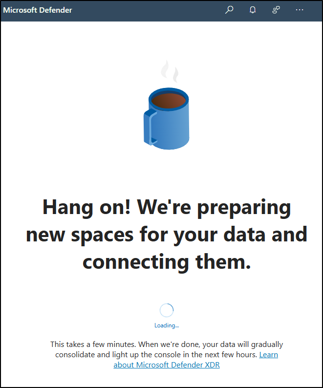

---
lab:
  title: Aufbau der Übung - Bereiten Sie Ihre Übungsumgebung für die Verwaltung vor
  module: Lab setup
---

## WWL-Mandanten – Nutzungsbedingungen

Wenn Ihnen im Rahmen einer Präsenzschulung ein Mandant zugewiesen worden ist, steht dieser für Praxislabs innerhalb der Präsenzschulung zur Verfügung.

Mandanten sollten nicht für Zwecke außerhalb von Praxislabs freigegeben oder verwendet werden. Der in diesem Kurs verwendete Mandant ist ein Testmandant; er kann nach Abschluss des Kurses nicht verwendet oder erreicht werden und ist nicht für Erweiterungen geeignet.

Mandanten dürfen nicht in ein kostenpflichtiges Abonnement konvertiert werden. Die im Rahmen dieses Kurses erworbenen Mandanten verbleiben im Eigentum der Microsoft Corporation, und wir behalten uns das Recht vor, jederzeit auf Mandanten zuzugreifen und diese zurückzuziehen.

# Aufbau der Übung - Bereiten Sie Ihre Übungsumgebung für die Verwaltung vor

In dieser Übung konfigurieren Sie Ihre Umgebung und bereiten sie für Verwaltungsaufgaben vor. Sie aktivieren die erforderlichen Funktionen, legen die administrativen Berechtigungen fest und sorgen für die richtige Konfiguration der wichtigsten Elemente.

**Aufgaben:**

1. Aktivieren der Überwachung im Microsoft Purview-Portal
1. Festlegen von Benutzerkennwörtern für Lab-Übungen
1. Aktivieren des Geräte-Onboardings
1. Aktivieren von Insider-Risikoanalysen

## Aufgabe 1 - Aktivieren Sie Audit im Microsoft Purview-Portal

In dieser Aufgabe aktivieren Sie die Überwachung im Microsoft Purview-Portal, um Portalaktivitäten zu überwachen.

1. Melden Sie sich bei Client 1 VM (SC-401-CL1) als Admin beim **SC-401-CL1\admin**-Konto an und melden Sie sich mit dem MOD-Admin-Konto bei Microsoft 365 an.

1. Navigieren Sie in Microsoft Edge zum Microsoft Purview-Portal, `https://purview.microsoft.com`, und melden sich an.

1. Auf dem Bildschirm erscheint eine Meldung über das neue Microsoft Purview-Portal. Wählen Sie **Erste Schritte**, um Zugriff auf das neue Portal zu erhalten.

    

1. Wählen Sie **Lösungen** in der linken Seitenleiste und wählen Sie dann **Überwachen**.

1. Wählen Sie auf der Seite **Suche** die Leiste **Aufzeichnung von Benutzenden- und Admin-Aktivitäten starten** aus, um die Überwachungsprotokollierung zu aktivieren.

    

1. Sobald Sie diese Option wählen, sollte der blaue Balken von dieser Seite verschwinden.

<!----- PowerShell instructions

1. Open an elevated Terminal window by selecting the Windows button with the right mouse button and then select **Terminal (Admin)**.

1. Run the **Install Module** cmdlet in the terminal window to install the latest **Exchange Online PowerShell** module version:

    ```powershell
    Install-Module ExchangeOnlineManagement
    ```

1. Confirm the NuGet provider prompt  by typing **Y** for Yes and press **Enter**.

1. Confirm the Untrusted repository security dialog with **Y** for Yes and press **Enter**.  This process may take some time to complete.

1. Run the **Set-ExecutionPolicy** cmdlet to change your execution policy and press **Enter**

    ```powershell
    Set-ExecutionPolicy -ExecutionPolicy RemoteSigned -Scope CurrentUser
    ```

1. Close the PowerShell window.

1. Open a regular (non-elevated) PowerShell window by right-clicking the Windows button and selecting **Terminal**.

1. Run the **Connect-ExchangeOnline** cmdlet to use the Exchange Online PowerShell module and connect to your tenant:

    ```powershell
    Connect-ExchangeOnline
    ```

1. When the **Sign in** window is displayed, sign in as `admin@WWLxZZZZZZ.onmicrosoft.com` (where ZZZZZZ is your unique tenant ID provided by your lab hosting provider). Admin's password should be provided by your lab hosting provider.

1. To check if Audit is enabled, run the **Get-AdminAuditLogConfig** cmdlet:

    ```powershell
    Get-AdminAuditLogConfig | FL UnifiedAuditLogIngestionEnabled
    ```

1. If _UnifiedAuditLogIngestionEnabled_ returns false, then Audit is disabled.

1. To enable the Audit log, run the **Set-AdminAuditLogConfig** cmdlet and set the **UnifiedAuditLogIngestionEnabled** to _true_:

    ```powershell
    Set-AdminAuditLogConfig -UnifiedAuditLogIngestionEnabled $true
    ```

1. To verify that Audit is enabled, run the **Get-AdminAuditLogConfig** cmdlet again:

    ```powershell
    Get-AdminAuditLogConfig | FL UnifiedAuditLogIngestionEnabled
    ```

1. _UnifiedAuditLogIngestionEnabled_ should return _true_ to let you know Audit is enabled.

-->

Sie haben die Überwachung in Microsoft 365 erfolgreich aktiviert.

## Aufgabe 2 - Festlegen von Benutzerkennwörtern für Lab-Übungen

In dieser Aufgabe legen Sie die Passwörter für die Benutzenden fest, die für die Übungen benötigt werden.

1. Melden Sie sich beim virtuellen Client 1 (SC-401-CL1) im **SC-401-CL1\admin** Konto an. Das Passwort sollte von Ihrem Provider für die Übung bereitgestellt werden.

1. Öffnen Sie **Microsoft Edge** und navigieren Sie zu **`https://admin.microsoft.com`**, um sich im Microsoft 365-Administrationszentrum als MOD-Administrator anzumelden, `admin@WWLxZZZZZZ.onmicrosoft.com` (wobei ZZZZZZ Ihre eindeutige Mandanten-ID ist, die von Ihrem Anbieter des Übungs-Hostings bereitgestellt wird).

1. Erweitern Sie im linken Navigationsbereich **Benutzende** und wählen Sie dann **Aktive Benutzende**.

1. Aktiviere das Kontrollkästchen links von **Joni Sherman**, **Lynne Robbins** und **Megan Bowen**.

   Diese Konten werden während der gesamten Lab-Übungen verwendet.

   

1. Wählen Sie die Schaltfläche **Passwort zurücksetzen** in der oberen Navigation, um alle drei Passwörter zurückzusetzen.

   

1. Vergewissern Sie sich auf der rechten Flyout-Seite **Passwort zurücksetzen**, dass beide Kontrollkästchen nicht aktiviert sind.

   Dadurch wird sichergestellt, dass Sie für die drei Benutzenden, die für die Übungen verwendet werden, ein Passwort auswählen können und dass diese Passwörter bei der ersten Anmeldung nicht zurückgesetzt werden müssen.

1. Geben Sie in das Feld **Passwort** ein Passwort ein, das Sie sich merken können, um die Passwörter der Benutzenden zurückzusetzen, die in zukünftigen Übungen verwendet werden sollen.

1. Wählen Sie unten auf der Flyout-Seite **Passwort zurücksetzen** die Schaltfläche **Passwort zurücksetzen**.

1. Auf der Seite **Passwörter wurden zurückgesetzt** sollten Sie die drei Benutzenden-Konten sehen, die zurückgesetzt worden sind. Wählen Sie unten auf dieser Flyout-Seite **Schließen**.

Sie haben die Passwörter für Lab-Übungen erfolgreich zurückgesetzt.

## Aufgabe 3 - Aktivieren der Geräteeinbindung

In dieser Aufgabe aktivieren Sie die Geräteeinbindung für Ihr Unternehmen.

1. Sie sollten weiterhin bei Client 1 VM (SC-401-CL1) im **SC-401-CL1\admin**-Konto angemeldet sein und als MOD-Administrator in Microsoft 365 angemeldet sein.

1. Navigieren Sie in **Microsoft Edge** zu **`https://purview.microsoft.com`**, um sich bei Microsoft Purview anzumelden, und wählen Sie dann **Einstellungen** in der linken Seitenleiste.

1. Erweitern Sie in der linken Seitenleiste **Geräteeinbindung** und wählen Sie dann **Geräte**.

1. Wählen Sie auf der Seite **Geräte** die Option **Geräteeinbindung einschalten** und wählen Sie dann **Ok**, um die Geräteeinbindung zu aktivieren.

1. Wenn Sie dazu aufgefordert werden, wählen Sie **OK**, um zu bestätigen, dass die Überwachung des Geräts aktiviert ist.

Sie haben nun die Geräteeinbindung aktiviert und können damit beginnen, Geräte einzubinden, die mit Endpoint DLP-Richtlinien geschützt werden sollen. Die Aktivierung der Funktion kann bis zu 30 Minuten dauern.

## Aufgabe 4 – Aktivierung der Insider-Risikoanalyse und Datenfreigabe

In dieser Aufgabe aktivieren Sie Analysen und die gemeinsame Nutzung von Daten für das Insider-Risikomanagement.

1. Sie sollten weiterhin bei Client 1 VM (SC-401-CL1) im **SC-401-CL1\admin**-Konto angemeldet sein und als MOD-Administrator in Microsoft Purview angemeldet sein.

1. Navigieren Sie in Microsoft Purview zu **Einstellungen** > **Insider-Risikomanagement** > **Analysen**.

1. Schalten Sie diese Einstellungen auf **Ein** um:

   - **Erkenntnisse auf Mandantenebene anzeigen**

   - **Erkenntnisse auf Benutzerebene anzeigen**

1. Wählen Sie unten auf der Seite **Speichern** aus.

1. Wählen Sie im linken Navigationsbereich **Datenfreigabe**.

1. Schalten Sie im Abschnitt Datenfreigabe die Option **Benutzer-Risikodetails mit anderen Sicherheitslösungen teilen** auf **Ein**.

1. Wählen Sie unten auf der Seite **Speichern** aus.

Sie haben die Analyse und Datenfreigabe für das Insider-Risikomanagement aktiviert.

## Aufgabe 5 - Initialisieren von Microsoft Defender XDR

Bei dieser Aufgabe öffnen Sie Microsoft Defender und warten, bis Microsoft Defender XDR die Initialisierung beendet.

1. Sie sollten weiterhin bei Client 1 VM (SC-401-CL1) im **SC-401-CL1\admin**-Konto angemeldet sein und als MOD-Administrator in Microsoft Purview angemeldet sein.

1. Navigieren Sie in **Microsoft Edge** zu **`https://security.microsoft.com/`**, um Microsoft Defender zu öffnen.

1. Wählen Sie im Navigationsbereich **Untersuchung & Reaktion** > **Incidents & Warnungen** > **Incidents**.

1. Es wird eine Meldung angezeigt, dass Microsoft Defender XDR vorbereitet wird. Dieser Vorgang läuft automatisch ab und kann einige Minuten dauern.

   

Microsoft Defender XDR wird gerade initialisiert. Sie können mit anderen Aufgaben fortfahren, während das Einrichten beendet wird.
