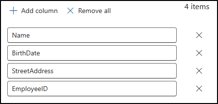
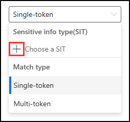
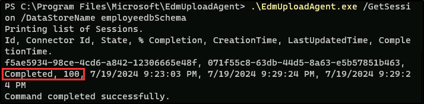

---
lab:
  title: Übung 2 - Erstellen und Verwalten sensibler Informationstypen
  module: Module 1 - Implement Information Protection
---


# Übung 1 - Übung 2 - Erstellen und Verwalten sensibler Informationstypen

Joni Sherman, Verwaltung für Informationssicherheit bei Contoso Ltd., aktualisiert die Informationsschutzstrategie des Unternehmens nach früheren Incidents, bei denen es um die unbeabsichtigte Weitergabe von personenbezogenen Daten in Kundendienst-Tickets ging. Sie muss benutzerdefinierte Typen sensibler Informationen erstellen und testen, mit denen IDs mitarbeitender Personen und Verweise auf persönliche Gesundheitsinformationen in Dokumenten und E-Mails erkannt werden können.

**Aufgaben:**

1. Erstellen Sie benutzerdefinierte sensible Informationstypen.
1. Ändern des Konfidenzniveaus zur Reduzierung von Fehlalarmen
1. Erstellen Sie eine Sicherheitsgruppe und weisen Sie Rollen zu, um einen EDM-Klassifizierer zu erstellen
1. Erstellen eines EDM-basierten Klassifizierungsinformationstyps
1. Erstellen einer EDM-basierten Klassifizierungsdatenquelle
1. Erstellen eines Schlüsselwörterbuchs
1. Testen benutzerdefinierter sensibler Informationstypen

## Aufgabe 1 - Erstellen benutzerdefinierter sensibler Informationstypen

In dieser Aufgabe erstellen Sie einen neuen benutzerdefinierten sensiblen Informationstyp, der das Muster der Mitarbeitenden-IDs in der Nähe der Schlüsselwörter "Mitarbeitender" und "ID" erkennt.

1. Sie sollten weiterhin bei Client 1 VM (SC-401-CL1) im **SC-401-CL1\admin**-Konto angemeldet sein.

1. Navigieren Sie in **Microsoft Edge** zu **`https://purview.microsoft.com`** und melden Sie sich beim Microsoft Purview-Portal als `JoniS@WWLxZZZZZZ.onmicrosoft.com` an (wobei ZZZZZZ Ihre eindeutige Mandanten-ID ist, die von Ihrem Anbieter für das Hosting von Übungen bereitgestellt wird). Das Passwort von Joni wurde in einer früheren Übung festgelegt.

1. Wählen Sie in der linken Seitenleiste **Lösungen** und dann **Informationsschutz**.

1. Erweitern Sie in der linken Seitenleiste **Klassifizierer** und wählen Sie dann **Typen vertraulicher Informationen**.

1. Auf der Seite **Typen vertraulicher Informationen** wählen Sie **+ Typ vertraulicher Informationen erstellen**, um die Konfiguration des Typs vertraulicher Informationen zu starten.

1. Geben Sie auf der Seite **Benennen Sie den Typ Ihrer vertraulichen Informationen** ein:

    - **Name**: `Contoso Employee IDs`
    - **Beschreibung:** `Pattern for Contoso employee IDs.`

1. Wählen Sie **Weiter** aus.

1. Wählen Sie auf der Seite **Muster für diesen vertraulichen Informationstyp definieren** die Option **Muster erstellen** aus.

1. Wählen Sie im Bedienfeld **Neues Muster** auf der rechten Seite **+ Primärelement hinzufügen** > **Regulärer Ausdruck**.

1. Geben Sie im Flyout-Bedienfeld **+ Einen regulären Ausdruck hinzufügen** auf der rechten Seite ein:

   - **ID**: `Contoso IDs`
   - **Regulärer Ausdruck**: `[A-Z]{3}[0-9]{6}`
   - Wählen Sie die Optionsschaltfläche für _Zeichenfolgenübereinstimmung_.

1. Wählen Sie **Erledigt** am unteren Rand des Flyout-Bedienfelds.

1. Zurück auf dem Flyout-Bedienfeld **Neues Muster** wählen Sie unter **Unterstützende Elemente** das Dropdownmenü **+ Unterstützende Elemente oder Elementgruppen hinzufügen** und wählen Sie **Schlüsselwortliste** aus.

1. Auf dem Flyout-Bedienfeld **Schlüsselwortliste hinzufügen** auf der rechten Seite, geben Sie ein:

   - **ID**: `Employee ID keywords`
   - **Keine Beachtung von Groß-/Kleinschreibung**:

      ```text
      Employee
      ID
      ```

   - Wählen Sie die Optionsschaltfläche für _Wortübereinstimmung_

1. Wählen Sie **Erledigt** am unteren Rand des Flyout-Bedienfelds.

1. Verringern Sie im Flyout-Bedienfeld **Neues Muster** unter **Zeichennähe** den Wert **Erkennen Sie primäre UND unterstützende Elemente** auf `100` Zeichen.

1. Wählen Sie die Schaltfläche **Erstellen** am unteren Rand des Flyout-Bedienfeldes.

1. Zurück auf der Seite **Muster für diesen sensiblen Informationstyp definieren** wählen Sie **Weiter**.

1. Verwenden Sie auf der Seite **Wählen Sie die empfohlene Stufe für die Anzeige in den Konformitätsrichtlinien** den Standardwert und wählen Sie **Weiter**.

1. Überprüfen Sie auf der Seite **Einstellungen überprüfen und fertigstellen** die Einstellungen, und wählen Sie **Erstellen** aus. Wenn sie erfolgreich erstellt wurde, wählen Sie **Fertig** aus.

Sie haben erfolgreich einen neuen sensiblen Informationstyp erstellt, um Mitarbeitende-IDs im Muster von drei Großbuchstaben, sechs Zahlen und den Schlüsselwörtern 'Mitarbeitender' oder 'IDs' innerhalb eines Bereichs von 100 Zeichen zu identifizieren.

## Aufgabe 2 - Ändern des Konfidenzniveaus zur Verringerung falsch positiver Ergebnisse

Sie haben Berichte empfangen, dass einige Dokumente, die IDs mitarbeitender Personen enthalten, nicht erkannt werden. Um den Erkennungsumfang zu verbessern, senken Sie das Konfidenzniveau des Musters in der SIT für mitarbeitende Personen von Contoso, damit es auch dann ausgelöst wird, wenn nur ein Teil der Beweise gefunden wird, was die Wahrscheinlichkeit der Erkennung erhöht.

1. Sie sollten weiterhin bei Client 1 VM (SC-401-CL1) als **SC-401-CL1\admin**-Konto angemeldet sein und bei Microsoft Purview als Joni Sherman angemeldet sein.

1. Navigieren Sie in Microsoft Edge zu `https://purview.microsoft.com`.

1. Wählen Sie in der linken Navigation **Lösungen** > **Informationsschutz** > **Klassifizierer** > **Sensible Informationstypen**.

1. Suchen Sie in der Liste nach `Contoso Employee IDs` und wählen Sie den SIT-Namen, um die Detailseite zu öffnen.

1. Wählen Sie **Bearbeiten** oben auf der Seite, um die SIT zu ändern.

1. Wählen Sie auf der Seite **Nennen Sie den Typ Ihrer vertraulichen Informationen** die Option **Weiter**.

1. Erweitern Sie auf der Seite **Muster für diesen Typ vertraulicher Informationen festlegen** **Muster Nr. 1** und überprüfen Sie die Einstellungen.

1. Wählen Sie das Bleistift-Symbol auf der rechten Seite, um das Muster zu bearbeiten.

1. Legen Sie im Flyout **Muster bearbeiten** die Dropdown-Liste **Konfidenzniveau** auf **Mittleres Konfidenzniveau** fest, was Übereinstimmungen mit weniger unterstützenden Belegen als bei hohem Konfidenzniveau ermöglicht.

1. Wählen Sie **Update** am unteren Rand des Flyouts.

1. Wählen Sie **Weiter**, bis Sie die Seite **Einstellungen überprüfen und beenden** erreichen.

1. Wählen Sie **Speichern** und dann **Erledigt**, um Ihren Typ vertraulicher Informationen zu aktualisieren.

1. Melden Sie sich von Jonis Konto ab, indem Sie das Profilbild von Joni Sherman oben rechts auswählen. Wählen Sie **Abmelden**, und schließen Sie dann das Browserfenster.

Sie haben das Konfidenzniveau erfolgreich gesenkt, um die Empfindlichkeit Ihrer benutzerdefinierten SIT zu erhöhen und sicherzustellen, dass Dokumente mit teilweise übereinstimmendem Inhalt mit größerer Wahrscheinlichkeit gekennzeichnet werden.

## Aufgabe 3 - Erstellen einer Sicherheitsgruppe und Zuweisung von Rollen zur Erstellung eines EDM Klassifizierers

In dieser Aufgabe erstellen Sie die Rollengruppe, um einen EDM Klassifizierer zu erstellen und fügen Joni zu der neuen Rollengruppe hinzu.

1. Sie sollten weiterhin bei Client 1 VM (SC-401-CL1) im **SC-401-CL1\admin**-Konto angemeldet sein.

1. Öffnen Sie **Microsoft Edge** und navigieren Sie zu **`https://admin.microsoft.com`**.

1. Wenn die Seite **Ein Konto auswählen** angezeigt wird, wählen Sie **Ein anderes Konto verwenden** und melden Sie sich als **MOD-Administrator**`admin@WWLxZZZZZZ.onmicrosoft.com` an (wobei ZZZZZZ Ihre eindeutige Mandanten-ID ist, die Sie von Ihrem Anbieter für das Hosting von Übungen erhalten haben). Das Passwort der administrierenden Person sollte von Ihrem Lab-Hosting-Anbieter bereitgestellt werden.

1. Erweitern Sie im linken Bereich **Teams & Gruppen** und wählen Sie dann **Aktive Teams & Gruppen**.

1. Wählen Sie oben auf der Seite **Aktive Teams und Gruppen** die Option **Sicherheitsgruppen** und dann die Option **+ Sicherheitsgruppe hinzufügen**.

    

1. Geben Sie auf dem Bildschirm **Grundlagen festlegen** ein:

    - **Name**: `EDM_DataUploaders`
    - **Beschreibung:** `People who upload data for EDM.`

1. Wählen Sie **Weiter** aus.

1. Auf der Seite **Einstellungen bearbeiten** belassen Sie die Standardeinstellungen und wählen dann **Weiter**.

1. Überprüfen Sie auf der Seite **Überprüfen und Beenden des Hinzufügens einer Gruppe** Ihre Einstellungen und wählen Sie **Gruppe erstellen**.

1. Wählen Sie auf der Seite **EDM_DataUploaders Gruppe erstellt** **Schließen**.

1. Zurück auf der Seite **Aktive Teams und Gruppen**, stellen Sie sicher, dass die Registerkarte **Sicherheit** im Menüband ausgewählt ist und wählen Sie dann die Schaltfläche **Aktualisieren**, um die neu erstellte Sicherheitsgruppe anzuzeigen. Wählen Sie die Gruppe **EDM_DataUploaders** aus der Liste, um den Flyoutbereich **EDM_DataUploaders** auf der rechten Seite zu öffnen.

1. Wählen Sie die Registerkarte **Mitglieder** und wählen Sie dann **Alle anzeigen und Mitglieder verwalten**.

1. Auf der Seite **Mitglieder** wählen Sie **+ Mitglieder hinzufügen**.

1. Aktivieren Sie auf der Seite **Mitglieder hinzufügen** das Kontrollkästchen links neben **Joni Sherman**, und wählen Sie dann die Schaltfläche **Hinzufügen (1)** unten im Flyout-Bereich.

1. Überprüfen Sie, ob **Joni Sherman** unter **Mitglieder** aufgeführt ist, und schließen Sie dann den Flyoutbereich, indem Sie das **X** oben rechts im Flyoutbereich auswählen.

1. Melden Sie sich vom Mod-Administrator-Konto ab, indem Sie das Symbol MA oben rechts im Fenster auswählen, dann **Abmelden** wählen und das Browserfenster schließen.

Sie haben erfolgreich die Gruppe **EDM_DataUploaders** erstellt und Joni den Zugriff zum Erstellen eines EDM Klassifizierers zugewiesen.

## Aufgabe 4 - Erstellen eines EDM-basierten Klassifizierungs-Informationstyps

In dieser Aufgabe erstellen Sie eine auf Exact Data Match (EDM) basierende Klassifizierung mit einem Datenbankschema von mitarbeitenden Personen.

1. Öffnen Sie **Microsoft Edge** und navigieren Sie zum Microsoft Purview-Portal unter `https://purview.microsoft.com`.

1. Wenn die Seite **Wählen Sie ein Konto** angezeigt wird, wählen Sie **Joni Sherman** und melden Sie sich an.

1. Navigieren Sie zu **Informationsschutz**, indem Sie in der linken Seitenleiste **Lösungen** > **Informationsschutz** auswählen.

1. Erweitern Sie auf der Seite **Informationsschutz** **Klassifizierer** und wählen Sie dann **EDM-Klassifizierer**.

1. Wählen Sie auf der Seite **EDM-Klassifizierer** die Option **+ EDM-Klassifizierer erstellen**.

1. Lesen Sie den Abschnitt **Machen Sie sich mit den Schritten vertraut, die erforderlich sind, um Ihren Klassifizierer in Betrieb zu nehmen**, um den Workflow für die Erstellung von EDM-Klassifizierern zu verstehen, und wählen Sie dann **Erstellen Sie einen EDM-Klassifizierer**.

1. Auf der Seite **Benennen und beschreiben Sie Ihren EDM Klassifizierer**, geben Sie ein:

    - **Name**: `employeedb`
    - **Beschreibung:** `Employee Database schema`

1. Wählen Sie **Weiter** aus.

1. Wählen Sie auf der Seite **Wählen Sie eine Methode zur Definition Ihres Schemas** die Option **Manuell definieren Sie Ihre Datenstruktur**, und wählen Sie dann **Weiter**.

1. Auf der Seite **Definieren Sie die Spalten, die die Daten enthalten, die Sie erkennen wollen**, geben Sie diese Spalten ein:

   - `Name`
   - `BirthDate`
   - `StreetAddress`
   - `EmployeeID`

   Wählen Sie **+ Spalte hinzufügen**, um die restlichen Felder hinzuzufügen, bis Sie insgesamt vier Spalten haben.

      

1. Wählen Sie **Weiter** aus.

1. Auf der Seite **Primärelemente auswählen** finden Sie die Spalte **MitarbeiterID**. Erweitern Sie das Dropdown-Menü **Übereinstimmungsmodus**, wo **Einzel-Token** angezeigt wird. Wählen Sie das **+** (Pluszeichen) für **Wählen Sie ein SIT**.

      

1. Wählen Sie im Flyoutbereich **Wählen Sie einen Typ vertraulicher Informationen für „EmployeeID“** auf der rechten Seite, in der Suchleiste, nach `Contoso`.

1. Der in einer früheren Aufgabe erstellte Typ **Contoso IDs mitarbeitender Personen** sollte angezeigt werden. Aktivieren Sie das Kontrollkästchen links von diesem Typ vertraulicher Informationen und wählen Sie dann **Speichern**.

1. Zurück auf der Seite **Primärelemente auswählen**, aktivieren Sie das Kontrollkästchen rechts neben **EmployeeID**, um dieses Feld als ein **Primärelement** zu kennzeichnen.

      

1. Wählen Sie **Weiter** aus.

1. Stellen Sie auf der Seite **Einstellungen für Daten in ausgewählten Spalten konfigurieren** sicher, dass der Schalter auf **Ja** für **Die gleichen Einstellungen für alle Spalten verwenden** festgelegt ist.

1. Aktivieren Sie das Kontrollkästchen für **Begrenzungszeichen und Interpunktion für Daten in allen Spalten ignorieren**.

1. Wählen Sie das Dropdown-Menü für **Wählen Sie Begrenzungszeichen und Interpunktion, die ignoriert werden sollen** und wählen Sie aus:

   - _Bindestrich ('-')_
   - _Period ('.')_
   - _Space (' ')_
   - _Offene Klammer ('(')_
   - _Schließende Klammer (')')_

1. Klicken Sie auf eine beliebige Stelle außerhalb der Auswahlliste und wählen Sie dann **Weiter**.

1. Auf der Seite **Erkennungsregeln für primäre Elemente konfigurieren**, belassen Sie die Standardkonfiguration und wählen Sie dann **Weiter**.

1. Wählen Sie auf der Seite **Einstellungen überprüfen und fertigstellen** die Option **Absenden** aus.

1. Auf der Seite **Sie haben erfolgreich einen EDM Klassifizierer erstellt**, stellen Sie sicher, dass Sie den **Schema-Namen** erfassen, um ihn in der nächsten Aufgabe zu verwenden.

      

1. Nachdem Sie den Schemanamen erfasst haben, wählen Sie **Fertig** aus.

1. Lassen Sie den Browser mit dem Microsoft Purview-Portal geöffnet.

Sie haben erfolgreich einen neuen EDM-basierten klassifizierungssensitiven Informationstyp zur Identifizierung von mitarbeitenden Personen aus einer Datenbankdateiquelle erstellt.

## Aufgabe 5 - Erstellen einer EDM-basierten Klassifizierungsdatenquelle

In dieser Aufgabe werden die tatsächlichen Daten für den EDM-basierten Typ der klassifizierungssensiblen Informationen über das EDM Upload Agent Gerät gehasht und hochgeladen.

1. Sie sollten weiterhin bei Client 1 VM (SC-401-CL1) als **SC-401-CL1\admin**-Konto angemeldet sein, und Sie sollten bei Microsoft 365 als **Joni Sherman** angemeldet sein.

1. Navigieren Sie in **Microsoft Edge** zu **`https://go.microsoft.com/fwlink/?linkid=2088639`**, um den EDM Upload Agent herunterzuladen.

1. Sobald der Download abgeschlossen ist, wählen Sie **Datei öffnen** im Browserfenster von Microsoft Edge, um den **Microsoft Exact Data Match Upload Agent Setup**-Assistenten zu öffnen.

1. Wählen Sie auf der Seite **Willkommen beim Microsoft Exact Data Match Upload Agent Setup Wizard** die Option **Weiter**.

1. Aktivieren Sie auf der Seite **Lizenzvereinbarung für Endbenutzer** das Kontrollkästchen **Ich akzeptiere die Begriffe der Lizenzvereinbarung** und wählen Sie dann **Weiter**.

1. Ändern Sie auf der Seite **Zielordner** den Standard-Zielpfad nicht und wählen Sie dann **Weiter**.

1. Wählen Sie auf der Seite **Bereit zur Installation des Microsoft Exact Data Match Upload Agent** die Option **Installieren**.

1. Wenn das Fenster **Benutzerkontensteuerung** erscheint, wählen Sie **Ja**, um dieser Anwendung zu erlauben, Änderungen an Ihrem Gerät vorzunehmen.

1. Wenn die Installation beendet ist, wählen Sie **Fertig stellen** auf der Seite **Microsoft Exact Data Match Upload Agent-Setup Assistent abgeschlossen**.

1. Suchen Sie in Ihrer Taskleiste im Suchfeld nach `Notepad`. Wählen Sie die App **Notepad** aus dem Abschnitt **Beste Übereinstimmung** der Suche.

1. Geben Sie in Notepad ein:

    ``` text
    Name,Birthdate,StreetAddress,EmployeeID
    Joni Sherman,01.06.1980,1 Main Street,CSO123456
    Lynne Robbins,31.01.1985,2 Secondary Street,CSO654321
    ```

1. Wählen Sie in Notepad **Datei** und **Speichern unter**, um die Datei zu speichern.

1. Wählen Sie **Dokumente** im linken Bereich und geben Sie `EmployeeData.csv` als **Dateiname** ein, dann wählen Sie **Speichern**.

1. Schließen Sie das Notepad-Fenster.

1. Klicken Sie mit der rechten Maustaste auf das Windows-Symbol in der Taskleiste und wählen Sie **Terminal (Admin)**.

1. Wenn das Fenster **Benutzerkontensteuerung** erscheint, wählen Sie **Ja**, um dieser Anwendung zu erlauben, Änderungen an Ihrem Gerät vorzunehmen.

1. Navigieren Sie im Terminalfenster zum Verzeichnis des EDM Upload Agent:

    ``` powershell
    cd "C:\Program Files\Microsoft\EdmUploadAgent"
    ```

1. Berechtigen Sie sich mit Ihrem Konto zum Hochladen der Datenbank in Ihren Mandanten, indem Sie dieses Cmdlet ausführen:

    ``` powershell
    .\EdmUploadAgent.exe /Authorize
    ```

1. Wenn das Fenster **Konto auswählen** angezeigt wird, melden Sie sich als `JoniS@WWLxZZZZZZ.onmicrosoft.com` an (wobei ZZZZZZ Ihre eindeutige Mandanten-ID ist, die Sie von Ihrem Anbieter für das Hosting von Übungen bereitgestellt haben). Das Passwort von Joni wurde in einer früheren Übung festgelegt.

1. Laden Sie die Datenbankschema-Definition des EDM-basierten Typs für vertrauliche Informationen herunter, indem Sie dieses Skript in PowerShell ausführen. Für den **DataStoreName** verwenden Sie hier den Schema-Namen, den Sie bei der vorherigen Aufgabe gespeichert haben.

    ``` powershell
    .\EdmUploadAgent.exe /SaveSchema /DataStoreName employeedbSchema /OutputDir "C:\Users\Admin\Documents\"
    ```

    Sie sollten eine Meldung erhalten, dass der Befehl erfolgreich abgeschlossen wurde.

    > [!Note] **Hinweis**: Wenn der letzte Befehl fehlschlägt, dauert es möglicherweise länger, bis die **EDM_DataUploaders**-Gruppenmitgliedschaft angewendet wird. Es kann bis zu einer Stunde dauern, bis der Download der Schema-Datei möglich ist.  Wenn es fehlschlägt, fahren Sie mit der nächsten Aufgabe fort und kehren Sie später zu diesem Schritt zurück.

1. Zerlegen Sie die Datenbankdatei in Hash-Werte und laden Sie sie in den EDM-basierten Typ für sensible Informationen hoch, indem Sie das folgende Skript in PowerShell ausführen:

    ``` powershell
    .\EdmUploadAgent.exe /UploadData /DataStoreName employeedbSchema /DataFile "C:\Users\Admin\Documents\EmployeeData.csv" /HashLocation "C:\Users\Admin\Documents\" /Schema "C:\Users\Admin\Documents\employeedbSchema.xml"
    ```

    Sie sollten eine Meldung erhalten, dass der Befehl erfolgreich abgeschlossen wurde.

1. Überprüfen Sie den Fortschritt des Uploads mit diesem Befehl:

    ``` powershell
    .\EdmUploadAgent.exe /GetSession /DataStoreName employeedbSchema
    ```

1. Wenn der Status im Terminalfenster **abgeschlossen** lautet, können Sie Ihre EDM-Daten verwenden.

    Alternativ können Sie auch das Fenster **EDM Klassifizierer** im Microsoft Purview Portal aktualisieren, um den Status des Hashs zu überprüfen. Sobald der Status auf **Index abgeschlossen** festgelegt ist, ist der Hash abgeschlossen.

    > [!Note] **Hinweis**: Dieser Vorgang kann einige Zeit in Anspruch nehmen. Möglicherweise müssen Sie das Skript „GetSession“ mehrmals ausführen oder die Seite der EDM-Klassifizierer aktualisieren, bevor der Status anzeigt, dass der Hash abgeschlossen ist.

    

    

1. Schließen Sie das Terminalfenster.

Sie haben erfolgreich eine Datenbankdatei für einen EDM-basierten klassifizierungssensiblen Informationstyp gehasht und hochgeladen.

## Aufgabe 6 - Erstellen eines Schlüsselwörterbuchs

Mehrere Verstöße gegen die Weitergabe personenbezogener Daten ereigneten sich, als Benutzende E-Mails verschickten, nachdem sich Kolleginnen und Kollegen krank gemeldet hatten. In diesen Fällen wurde der Grund für die Krankheit bzw. das Leiden offengelegt. Wir wollen nicht, dass das passiert. In dieser Aufgabe erstellen Sie ein Schlüsselwörterbuch, um die Weitergabe persönlicher Daten in E-Mails zu verhindern.

1. Sie sollten weiterhin bei Client 1 VM (SC-401-CL1) als **SC-401-CL1\admin**-Konto angemeldet sein, und Sie sollten bei Microsoft 365 als **Joni Sherman** angemeldet sein.

1. Das Microsoft Purview-Portal sollte immer noch auf der EDM Klassifizierer-Seite in Microsoft Edge sein. Falls nicht, navigieren Sie in Microsoft Edge zu `https://purview.microsoft.com` > **Lösungen** > **Informationsschutz**.

1. Erweitern Sie in der linken Seitenleiste **Klassifizierer** und wählen Sie dann **Typen vertraulicher Informationen**.

1. Wählen Sie **+ Typ vertraulicher Informationen erstellen**, um die Konfiguration für einen neuen Typ vertraulicher Informationen zu öffnen.

1. Geben Sie auf der Seite **Benennen Sie den Typ Ihrer vertraulichen Informationen** ein:

    - **Name**: `Contoso Diseases List`
    - **Beschreibung:** `List of possible diseases of employees.`

1. Wählen Sie **Weiter** aus.

1. Wählen Sie auf der Seite **Muster für diesen Typ vertrauliche Informationen definieren** die Option **+ Muster erstellen** aus.

1. Im Flyoutbereich **Neues Muster** auf der rechten Seite wählen Sie unter **Primärelement** die Option **+ Primärelement hinzufügen**, dann wählen Sie **Schlüsselwortwörterbuch**.

1. Auf der Seite **Schlüsselwörterbuch hinzufügen** geben Sie ein:

   - **Name**: `Diseases Dictionary`
   - **Schlüsselwörter:**

    ```text
    flu
    influenza
    cold
    bronchitis
    otitis
    ```

1. Wählen Sie **Erledigt** am unteren Rand des Flyout-Bedienfelds.

1. Zurück auf der Seite **Neues Muster**, wählen Sie unter **Unterstützende Elemente** die Option **+ Unterstützende Elemente oder Elementgruppe hinzufügen**, dann wählen Sie **Schlüsselwortliste**, um zusätzliche Unterstützung für das Schlüsselwort-Wörterbuch hinzuzufügen.

1. Auf der Seite **Schlüsselwortliste hinzufügen** geben Sie ein:

   - **ID**: `Employee absence`
   - **Keine Beachtung von Groß-/Kleinschreibung**:

    ``` text
    employee
    absence
    reason
    ```

1. Wählen Sie **Erledigt** am unteren Rand des Flyout-Bedienfelds.

1. Zurück auf der Seite **Neues Muster**, überprüfen Sie die Konfiguration und wählen Sie **Erstellen**.

1. Zurück auf der Seite **Muster für diesen sensiblen Info-Typ definieren**, wählen Sie **Weiter**.

1. Wählen Sie auf der Seite **Wählen Sie die empfohlene Konfidenzstufe, die in Richtlinien zur Konformität angezeigt werden soll**, belassen Sie den Standardwert und wählen Sie dann **Weiter**.

1. Auf der Seite **Einstellungen überprüfen und beenden** überprüfen Sie Ihre Einstellungen und wählen **Erstellen**. Sobald Ihr Typ vertraulicher Informationen erstellt ist, wählen Sie **Erledigt** auf der Seite **Ihr Typ vertraulicher Informationen ist erstellt**.

1. Lassen Sie das Browserfenster im Microsoft Purview-Portal geöffnet.

Sie haben erfolgreich einen neuen Typ sensibler Informationen auf der Grundlage eines Schlüsselwort-Wörterbuchs erstellt und weitere Schlüsselwörter hinzugefügt, um die Falsch-Positiv-Rate zu senken.

## Aufgabe 7 - Testen von benutzerdefinierten sensiblen Informationstypen

Testen Sie stets benutzerdefinierte Typen sensibler Informationen, bevor Sie sie in Richtlinien verwenden. Andernfalls kann es zu Datenverlusten oder Lecks kommen, wenn das Muster falsch konfiguriert ist.

1. Sie sollten weiterhin bei Client 1 VM (SC-401-CL1) als **SC-401-CL1\admin**-Konto angemeldet sein, und Sie sollten bei Microsoft 365 als **Joni Sherman** angemeldet sein.

1. Suchen Sie in Ihrer Taskleiste im Suchfeld nach `Notepad`. Wählen Sie die App **Notepad** aus dem Abschnitt **Beste Übereinstimmung** der Suche.

1. Geben Sie in Notepad ein:

    ``` text
    Employee Joni Sherman EMP123456 is absent because of the flu/influenza.
    ```

1. Wählen Sie **Datei** > **Speichern unter** aus.

1. Wählen Sie **Dokumente** im linken Bereich und geben Sie `SickTestData.txt` als **Dateiname** ein, dann wählen Sie **Speichern**.

1. Schließen Sie das Notepad-Fenster.

1. Zurück in **Microsoft Edge** sollte das Microsoft Purview-Portal auf der Seite **Sensitive Typen vertraulicher Informationen** noch geöffnet sein.

1. In der **Suchleiste** oben rechts geben Sie `Contoso` ein und drücken die Eingabetaste.

1. Wählen Sie **Contoso Mitarbeitende IDs**.

1. Wählen Sie **Test** aus.

1. Wählen Sie im rechten Flyoutbereich **Datei zum Test von „Contoso Employee IDs“** hochladen **Datei hochladen**.

1. Wählen Sie **Dokumente** im linken Bereich, markieren Sie die Datei _SickTestData.txt_ und wählen Sie dann **Öffnen**.

1. Wählen Sie **Test**, um die Analyse zu starten.

1. Überprüfen Sie auf der Seite **Match results** die Übereinstimmungen und wählen Sie dann **Finish**, um den Test zu beenden.

1. Navigieren Sie zurück zu **Sensitive Typen vertraulicher Informationen** und suchen Sie erneut nach `Contoso`.

1. Wählen Sie dieses Mal den Typ **Liste der Krankheiten** und dann **Test**.

1. Wählen Sie im rechten Flyoutbereich **Datei zum Testen von „Contoso Diseases List“** hochladen **Datei hochladen**.

1. Wählen Sie im Bereich **Datei zum Test hochladen** die Option **Datei hochladen**.

1. Wählen Sie **Dokumente** im linken Bereich, markieren Sie die Datei _SickTestData.txt_ und wählen Sie dann **Öffnen**.

1. Wählen Sie **Test**, um die Analyse zu starten.

1. Überprüfen Sie auf der Seite **Match results** die Übereinstimmungen und wählen Sie dann **Finish**, um den Test zu beenden.

Sie haben die beiden benutzerdefinierten sensiblen Informationstypen erfolgreich getestet und festgestellt, dass die Suchmuster wie erwartet funktionieren.
