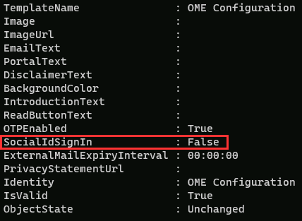

---
lab:
  title: Übung 4 - Bereitstellen von Microsoft Purview-Nachrichtenverschlüsselung
  module: Module 1 - Implement Information Protection
---

# Übung 1 – Übung 4 – Bereitstellen von Microsoft Purview-Nachrichtenverschlüsselung

Joni Sherman, der Informationssicherheitsadministrator von Contoso Ltd. hat die Aufgabe, die sichere Kommunikation zwischen den Abteilungen zu gewährleisten. Um dies zu unterstützen, konfiguriert sie die Microsoft Purview-Nachrichtenverschlüsselung für Contoso, einschließlich der Änderung der Standardeinstellungen und der Erstellung eines benutzerdefinierten Branding-Erlebnisses für die Finanzabteilung.

**Aufgaben:**

1. Überprüfen der Funktionalität von Azure RMS
1. Ändern der Standardbrandingvorlage
1. Überprüfen des Standardmäßigen Brandingverhaltens
1. Erstellen einer benutzerdefinierten Brandingvorlage
1. Überprüfen des benutzerdefinierten Brandingverhaltens

## Aufgabe 1 – Überprüfen der Azure RMS-Funktionalität

In dieser Aufgabe überprüfen Sie die richtige Azure RMS-Funktionalität Ihres Mandanten.

1. Sie sollten weiterhin bei Client 1 VM (SC-401-CL1) im **SC-401-CL1\admin**-Konto angemeldet sein.

1. Öffnen Sie PowerShell, indem Sie mit der rechten Maustaste auf die Schaltfläche Start in der Taskleiste klicken und **Terminal** auswählen.

1. Führen Sie das Cmdlet **Connect-ExchangeOnline** aus, um das Exchange Online PowerShell-Modul zu verwenden und eine Verbindung zu Ihrem Mandanten herzustellen:

    ```powershell
    Connect-ExchangeOnline
    ```

1. Wenn das Fenster **Anmelden** angezeigt wird, melden Sie sich als `JoniS@WWLxZZZZZZ.onmicrosoft.com` an (wobei ZZZZZZ Ihre eindeutige Mandanten-ID ist, die Sie von Ihrem Provider für die Übung bereitgestellt haben). Sie verwenden das Passwort, auf das Sie Joni in einer früheren Übung zurückgesetzt haben.

1. Führen Sie das Cmdlet **Get-IRMConfiguration** aus, um zu überprüfen, ob Azure RMS und IRM in Ihrem Mandanten aktiviert sind:

    ```powershell
    Get-IRMConfiguration | fl AzureRMSLicensingEnabled
    ```

   Das Ergebnis **AzureRMSLicensingEnabled** sollte **True** sein.

1. Führen Sie das Cmdlet **Test-IRMConfiguration** aus, um die Funktionalität von Azure RMS mithilfe von Office 365 Message Encryption mit **Megan Bowen** als Absender und Empfänger zu testen:

    ```powershell
    Test-IRMConfiguration -Sender MeganB@contoso.com -Recipient MeganB@contoso.com
    ```

    

    Überprüfen Sie, ob alle Tests den Status PASS haben und keine Fehler angezeigt werden.

1. Lassen Sie das PowerShell-Fenster geöffnet.

Sie haben das Exchange Online PowerShell-Modul erfolgreich installiert, eine Verbindung zu Ihrem Mandanten hergestellt und die korrekte Funktionalität von Azure RMS überprüft.

## Aufgabe 2 - Ändern der Standard-Branding-Vorlage

In Ihrer Organisation ist es erforderlich, die Vertrauensbeziehung zu ausländischen Identitätsanbietern wie Google oder Facebook einzuschränken. Da diese Social-IDs standardmäßig für den Zugriff auf mit Nachrichtenverschlüsselung geschützte Meldungen aktiviert sind, müssen Sie die Verwendung von Social-IDs für alle Benutzenden in Ihrem Unternehmen deaktivieren.

1. Sie sollten immer noch bei Ihrer Client 1 VM (SC-401-CL1) im **SC-401-CL1\admin**-Konto angemeldet sein und es sollte immer noch ein geöffnetes PowerShell-Fenster mit verbundenem Exchange Online vorhanden sein.

1. Führen Sie das Cmdlet **Get-OMEConfiguration** aus, um die Standardkonfiguration zu konfigurieren:

    ```powershell
    Get-OMEConfiguration -Identity "OME Configuration" | fl
    ```

   Überprüfen Sie die Einstellungen und stellen Sie sicher, dass die Eigenschaft SocialIdSignIn auf **True** festgelegt ist.

    

1. Führen Sie das Cmdlet **Set-OMEConfiguration** aus, um die Verwendung von Social IDs für den Zugriff auf Meldungen aus Ihrem mit OME geschützten Mandant einzuschränken:

    ```powershell
    Set-OMEConfiguration -Identity "OME Configuration" -SocialIdSignIn:$false
    ```

1. Bestätigen Sie die Warnmeldung zum Anpassen der Standardvorlage, indem Sie **Y** für Ja eingeben und dann **Eingabe** drücken.

1. Führen Sie das Cmdlet **Get-OMEConfiguration** aus, um die Standardkonfiguration erneut zu überprüfen und zu validieren:

    ```powershell
    Get-OMEConfiguration -Identity "OME Configuration" | fl
    ```

    

   Beachten Sie, dass das Ergebnis zeigen sollte, dass SocialIdSignIn auf **False** festgelegt ist. Lassen Sie das PowerShell-Fenster und den Client geöffnet.

Sie haben die Anbieter sozialer Identitäten erfolgreich deaktiviert und damit sichergestellt, dass verschlüsselte E-Mails von Contoso nur mithilfe von Microsoft-Konten oder Einmalpasswörtern geöffnet werden können, was die Kontrolle über den Zugriff auf sensible Meldungen verbessert.

## Aufgabe 3 - Validieren des Standard-Branding-Verhaltens

Sie müssen bestätigen, dass externen Empfängern kein Dialogfeld mit sozialen IDs angezeigt wird, wenn sie eine mit Office 365 Message Encryption geschützte Nachricht von Benutzenden Ihres Mandanten empfangen und sie jederzeit den OTP für den Zugriff auf den verschlüsselten Inhalt verwenden müssen.

1. Sie sollten immer noch bei Ihrer Client 1 VM (SC-401-CL1) als **SC-401-CL1\admin** angemeldet sein.

1. Öffnen Sie **Microsoft Edge** in einem InPrivate-Fenster, indem Sie mit der rechten Maustaste auf Microsoft Edge in der Taskleiste klicken und **Neues InPrivate-Fenster** wählen.

1. Navigieren Sie zu **`https://outlook.office.com`** und melden Sie sich bei Outlook im Web als `LynneR@WWLxZZZZZZ.onmicrosoft.com` an (wobei ZZZZZZ Ihre eindeutige Mandanten-ID ist, die Sie von Ihrem Anbieter für das Hosting von Übungen bereitgestellt haben). Lynnes Passwort wurde in einer früheren Übung festgelegt.

1. Aktivieren Sie im Dialogfeld **Angemeldet bleiben?** das Kontrollkästchen **Dies nicht mehr anzeigen** und wählen Sie dann **Nein**.

1. Wählen Sie in Outlook im Web **Neue E-Mail**.

1. In der Zeile **An** geben Sie Ihre persönliche oder eine andere E-Mail-Adresse eines Dritten ein, die nicht in der Domäne des Mandanten enthalten ist. Geben Sie **`Secret Message`** in die Betreffzeile und **`My super-secret message.`** in den Text der E-Mail ein.

1. Wählen Sie im oberen Bereich **Optionen** und dann **Verschlüsseln**, um die Meldung zu verschlüsseln. Wenn Sie die Meldung erfolgreich verschlüsselt haben, sollten Sie einen Hinweis sehen, der besagt: „Verschlüsseln“: Diese Meldung ist verschlüsselt. Die Empfänger können die Verschlüsselung nicht aufheben.“

      

1. Wählen Sie **Senden** aus, um die Nachricht zu senden. Lassen Sie das Outlook-Fenster geöffnet.

1. Melden Sie sich in Ihrem persönlichen E-Mail-Konto in einem neuen Fenster an und öffnen Sie die Nachricht von Lynne Robbins. Wenn Sie diese E-Mail an ein Microsoft-Konto (z. B. @outlook.com) gesendet haben, wird die Verschlüsselung möglicherweise automatisch verarbeitet, und Sie sehen die Nachricht automatisch. Wenn Sie die E-Mail an einen anderen E-Mail-Dienst wie (@gmail.com) gesendet haben, müssen Sie möglicherweise die nächsten Schritte ausführen, um die Verschlüsselung zu verarbeiten und die Nachricht zu lesen.

    > [!Note] **Hinweis**: Möglicherweise müssen Sie Ihren Junk- oder Spam-Ordner auf diese Nachricht von Lynne Robbins überprüfen.

1. Wählen Sie **Nachricht lesen**.

1. Da Social IDs deaktiviert sind, sollten Sie keine Option sehen, um sich mit einem Konto eines Drittanbieters anzumelden.

1. Wählen Sie **Mit einmaligem Passcode anmelden**, um eine begrenzte Zeitkennung zu erhalten.

1. Gehen Sie zu Ihrem persönlichen E-Mail-Portal und öffnen Sie die Nachricht mit dem Betreff **Ihr einmaliger Passcode zur Ansicht der Nachricht**.

1. Kopieren Sie den Passcode, fügen Sie ihn in das OME-Portal ein und wählen Sie **Fortfahren**.

1. Überprüfen Sie die verschlüsselte Nachricht.

Sie haben die geänderte Standard-OME-Vorlage mit deaktivierten Social IDs erfolgreich getestet.

## Aufgabe 4 - Erstellen einer benutzerdefinierten Branding-Vorlage

Geschützte Nachrichten, die von der Finanzabteilung Ihres Unternehmens versandt werden, erfordern ein spezielles Branding, einschließlich angepasster Einleitungs- und Haupttexte und eines Links zum Haftungsausschluss in der Fußzeile. Die Finanzmeldungen sollen ebenfalls nach sieben Tagen ablaufen. In dieser Aufgabe werden Sie eine neue benutzerdefinierte OME-Konfiguration erstellen und eine Transportregel erstellen, um die OME-Konfiguration auf alle von der Finanzabteilung gesendeten E-Mails anzuwenden.

1. Sie sollten immer noch bei Ihrer Client 1 VM (SC-401-CL1) als **SC-401-CL1\admin** angemeldet sein, und es sollte immer noch ein geöffnetes PowerShell-Fenster mit verbundenem Exchange Online vorhanden sein.

1. Führen Sie das Cmdlet **New-OMEConfiguration** aus, um eine neue Konfiguration vorzunehmen:

    ```powershell
    New-OMEConfiguration -Identity "Finance Department" -ExternalMailExpiryInDays 7
    ```

1. Bestätigen Sie die Warnmeldung zum Anpassen der Vorlage mit **Y** für Ja und drücken Sie **Eingabe**.

1. Führen Sie das Cmdlet **Set-OMEConfiguration** mit dem Parameter _IntroductionText_ aus, um den Einleitungstext zu ändern:

    ```powershell
    Set-OMEConfiguration -Identity "Finance Department" -IntroductionText " from Contoso Ltd. finance department has sent you a secure message."
    ```

1. Bestätigen Sie die Warnmeldung zum Anpassen der Vorlage mit **Y** für Ja und drücken Sie **Eingabe**.

1. Führen Sie das Cmdlet **Set-OMEConfiguration** mit dem Parameter _EmailText_ aus, um den Nachrichtentext der verschlüsselten E-Mail zu aktualisieren:

    ```powershell
    Set-OMEConfiguration -Identity "Finance Department" -EmailText "Encrypted message sent from Contoso Ltd. finance department. Handle the content responsibly."
    ```

1. Bestätigen Sie die Warnmeldung zum Anpassen der Vorlage mit **Y** für Ja und drücken Sie **Eingabe**.

1. Führen Sie das Cmdlet **Set-OMEConfiguration** mit dem Parameter _PrivacyStatementURL_ aus, um die Haftungsausschluss-URL so zu ändern, dass sie auf die Website von Contoso mit den Datenschutzbestimmungen verweist:

    ```powershell
    Set-OMEConfiguration -Identity "Finance Department" -PrivacyStatementURL "https://contoso.com/privacystatement.html"
    ```

1. Bestätigen Sie die Warnmeldung zum Anpassen der Vorlage mit **Y** für Ja und drücken Sie **Eingabe**.

1. Führen Sie das Cmdlet **New-TransportRule** aus, um eine Mail Flow-Regel zu erstellen, die die benutzerdefinierte OME-Vorlage auf alle vom Finanzteam gesendeten Nachrichten anwendet. Dieser Vorgang kann einige Sekunden dauern.

    ```powershell
    New-TransportRule -Name "Encrypt all mails from Finance team" -FromScope InOrganization -FromMemberOf "Finance Team" -ApplyRightsProtectionCustomizationTemplate "Finance Department" -ApplyRightsProtectionTemplate Encrypt
    ```

1. Führen Sie das Cmdlet **Get-OMEConfiguration** aus, um die Änderungen zu überprüfen.

    ```powershell
    Get-OMEConfiguration -Identity "Finance Department" | Format-List
    ```

1. Schließen Sie das PowerShell-Fenster, nachdem Sie die Ergebnisse überprüft haben

Sie haben eine Transportregel konfiguriert, die sicherstellt, dass E-Mails aus der Finanzabteilung verschlüsselt und mit einem einheitlichen Branding versehen werden, wodurch die Messaging- und Sicherheitsstandards von Contoso gestärkt werden.

## Aufgabe 5 - Validieren des benutzerdefinierten Branding-Verhaltens

Um die neue benutzerdefinierte Konfiguration zu validieren, müssen Sie erneut das Konto von Lynne Robbins verwenden, die Mitglied des Finanzteams ist.

1. Gehen Sie zurück zu **Microsoft Edge** mit dem InPrivate Outlook im Webfenster, wo Sie immer noch als **Lynne Robbins** angemeldet sein sollten.

1. Wählen Sie **Neue E-Mail** im oberen linken Teil von Outlook im Web.

1. In der Zeile **An** geben Sie Ihre persönliche oder eine andere E-Mail-Adresse eines Dritten ein, die nicht in der Domäne des Mandanten enthalten ist. Geben Sie **`Finance Report`** in die Betreffzeile und **`Secret finance information.`** in den Text der E-Mail ein.

1. Wählen Sie **Senden**, um die Nachricht zu senden, und schließen Sie dann das Fenster InPrivate, in dem Sie als Lynne angemeldet sind.

1. Melden Sie sich in Ihrem persönlichen E-Mail-Konto an und öffnen Sie die Nachricht von Lynne Robbins.

1. Sie sollten eine Nachricht von Lynne Robbins sehen, die wie die folgende Abbildung aussieht.  Wählen Sie **Nachricht lesen**.

    

1. In der benutzerdefinierten Konfiguration sind beide Authentifizierungsoptionen verfügbar, was bedeutet, dass die Anmeldung mit der Social ID aktiviert ist. Wählen Sie **Mit einmaligem Passcode anmelden**, um eine begrenzte Zeitkennung zu erhalten.

1. Gehen Sie zu Ihrem persönlichen E-Mail-Portal und öffnen Sie die Nachricht mit dem Betreff **Ihr einmaliger Passcode zur Ansicht der Nachricht**.

1. Kopieren Sie den Passcode, fügen Sie ihn in das Portal ein und wählen Sie **Fortfahren**.

1. Überprüfen Sie die verschlüsselte Nachricht mit individuellem Branding. Schließen Sie das Fenster, in dem Ihr E-Mail-Konto geöffnet ist.

Sie haben die neue benutzerdefinierte Vorlage erfolgreich getestet.
