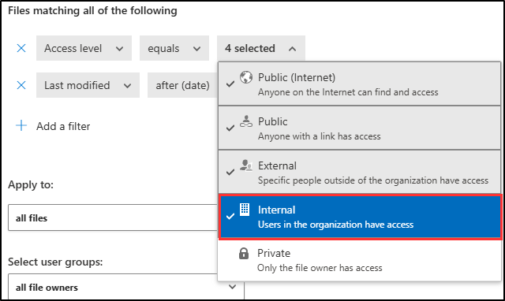

---
lab:
  title: Übung 1 - Implementieren und Verwalten von DLP-Richtlinien
  module: Module 2 - Implement Data Loss Prevention
---
## WWL-Mandanten – Nutzungsbedingungen

Wenn Ihnen im Rahmen einer Präsenzschulung ein Mandant zugewiesen worden ist, steht dieser für Praxislabs innerhalb der Präsenzschulung zur Verfügung.

Mandanten sollten nicht für Zwecke außerhalb von Praxislabs freigegeben oder verwendet werden. Der in diesem Kurs verwendete Mandant ist ein Testmandant; er kann nach Abschluss des Kurses nicht verwendet oder erreicht werden und ist nicht für Erweiterungen geeignet.

Mandanten dürfen nicht in ein kostenpflichtiges Abonnement konvertiert werden. Die im Rahmen dieses Kurses erworbenen Mandanten verbleiben im Eigentum der Microsoft Corporation, und wir behalten uns das Recht vor, jederzeit auf Mandanten zuzugreifen und diese zurückzuziehen.

# Lab 2 - Übung 1 - Implementieren und Verwalten von DLP-Richtlinien

Joni Sherman, der neu eingestellte Information Security Administrator bei Contoso Ltd., wurde gebeten, Richtlinien zur Verhinderung von Datenverlusten (DLP) zu konfigurieren, um sensible Kundendaten in Microsoft 365 zu schützen. In dieser Übung verwenden Sie Microsoft Purview und Microsoft Defender, um DLP-Richtlinien zu erstellen und zu verwalten, die die Freigabe sensibler Informationen wie Kreditkartennummern und IDs mitarbeitender Personen erkennen und einschränken.

**Aufgaben:**

1. Erstellen einer DLP-Richtlinie im Simulationsmodus
1. Ändern einer DLP-Richtlinie
1. Erstellen einer DLP-Richtlinie in PowerShell
1. Aktivieren einer Richtlinie im Simulationsmodus
1. Ändern der Richtlinienpriorität
1. Aktivieren Sie die Dateiüberprüfung in Microsoft 365 Defender
1. Erstellen einer Dateirichtlinie für Microsoft 365 Defender

## Aufgabe 1 – Erstellen einer DLP-Richtlinie im Simulationsmodus

In dieser Aufgabe werden Sie eine DLP-Richtlinie im Simulationsmodus erstellen, die auf Kreditkartennummern in Teams-Meldungen abzielt. Die Richtlinie benachrichtigt Benutzende, wenn sie versuchen, sensible Inhalte zu teilen, und erlaubt ihnen, sich mit einer Begründung darüber hinwegzusetzen.

1. Melden Sie sich beim virtuellen Client 1 (SC-401-CL1) im **SC-401-CL1\admin** Konto an.

1. Navigieren Sie in **Microsoft Edge** zu **`https://purview.microsoft.com`** und melden Sie sich im Microsoft Purview Portal als **Joni Sherman** an. Melden Sie sich als `JoniS@WWLxZZZZZZ.onmicrosoft.com` an (wobei ZZZZZZ Ihre eindeutige Mandanten-ID ist, die Sie von Ihrem Hosting-Anbieter für die Übung bereitgestellt haben). Das Passwort von Joni wurde in einer früheren Übung festgelegt.

1. Wählen Sie **Lösungen** > **Verhinderung von Datenverlust** > **Richtlinien**.

1. Wählen Sie auf der Seite **Richtlinien** die Option **+ Richtlinie erstellen**, um die Konfiguration zum Erstellen einer neuen Richtlinie zum Schutz vor Datenverlust zu starten.

1. Wählen Sie auf der Seite **Starten Sie mit einer Vorlage oder erstellen Sie eine benutzerdefinierte Richtlinie** die Kategorie **Benutzerdefiniert** und dann **Benutzerdefinierte Richtlinie** unter **Vorschriften**.

1. Wählen Sie **Weiter** aus.

1. Geben Sie auf der Seite **DLP-Richtlinie benennen** Folgendes ein:

   - **Name**: `DLP - Credit Card Protection`
   - **Beschreibung:** `Detect and restrict sharing of credit card numbers in Teams messages.`

1. Wählen Sie **Weiter** aus.

1. Auf der Seite **Admineinheiten zuweisen** wählen Sie **Weiter**.

1. Aktivieren Sie auf der Seite **Wählen Sie Speicherorte für die Anwendung der Richtlinie** den Speicherort nur für **Teams Chat- und Channel-Nachrichten**. Wenn andere Speicherorte ausgewählt sind, heben Sie die Auswahl auf.

1. Wählen Sie **Weiter** aus.

1. Wählen Sie auf der Seite **Richtlinieneinstellungen definieren** die Option **Erweiterte DLP-Regeln erstellen oder anpassen** und dann **Weiter** aus.

1. Wählen Sie auf der Seite **Erweiterte DLP-Regeln anpassen** die Option **+ Regel erstellen**.

1. Im Flyout **Regel erstellen**:
    - Geben Sie im Feld **Name** die Zeichenfolge `Credit card information` ein.

1. Wählen Sie unter **Bedingungen** die Option **+ Bedingung hinzufügen** > **Inhalt wird von Microsoft 365 freigegeben**.

1. Im Abschnitt **Inhalt wird von Microsoft 365 freigegeben**:
    - Wählen Sie die Option für **Mit Personen außerhalb meiner Organisation**.

1. Wählen Sie **+ Bedingung hinzufügen** > **Inhalt enthält**.

1. In dem neuen Abschnitt **Inhalt enthält**:
    - Wählen Sie **Hinzufügen** > **Typen vertraulicher Informationen**.
    - Suchen Sie auf der Seite **Typen vertraulicher Informationen** nach `Credit Card Number` und wählen Sie dann **Hinzufügen**.

1. Wählen Sie unter **Aktionen** die Option **+ Aktion hinzufügen** > **Zugriff einschränken oder Inhalte an Microsoft 365-Standorten verschlüsseln**.

1. Im Abschnitt **Zugriff einschränken oder Inhalt verschlüsseln**:
    - Wählen Sie **Nur Personen außerhalb Ihrer Organisation blockieren**.

1. Unter **Benutzerbenachrichtigungen**:
    - Aktivieren Sie die Umschaltfunktion für **Benutzen Sie Benachrichtigungen, um Ihre Benutzenden zu informieren und sie über die richtige Verwendung sensibler Daten aufzuklären.**.
    - Aktivieren Sie das Kontrollkästchen für **Benutzende im Office 365-Dienst mit einem Richtlinien-Tipp benachrichtigen**.

1. Unter **Außerkraftsetzungen durch Benutzende**:
    - Aktivieren Sie das Kontrollkästchen für **Benutzenden erlauben, Außerkraftsetzungen durch Benutzende aufzuheben** (Fabric, Exchange, SharePoint, OneDrive und Teams).
    - Aktivieren Sie das Kontrollkästchen für **Eine geschäftliche Begründung für die Außerkraftsetzung erforderlich machen**.

1. Unter **Incident-Berichte**, in der Dropdown-Liste **Verwenden Sie diese Schweregradstufe in administrativen Warnungen und Berichten**:
    - Wählen Sie **Niedrig**.

1. Wählen Sie am unteren Rand des Flyout-Bedienfelds **Regel erstellen** die Option **Speichern**.

1. Wählen Sie auf der Seite **Erweiterte DLP-Regeln anpassen** die Option **Weiter**.

1. Wählen Sie auf der Seite **Richtlinienmodus** die Option **Richtlinie im Simulationsmodus ausführen** und aktivieren Sie das Kontrollkästchen für **Richtlinientipps im Simulationsmodus anzeigen**.

1. Wählen Sie **Weiter** aus.

1. Auf der Seite **Überprüfen und beenden** überprüfen Sie Ihre Einstellungen und wählen dann **Absenden**.

1. Wählen Sie auf der Seite **Neue Richtlinie erstellt** die Option **Fertig** aus.

Sie haben eine DLP-Richtlinie erstellt, die den Inhalt von Teams nach Kreditkartennummern durchsucht und Außerkraftsetzungen mit einer geschäftlichen Begründung erlaubt.

## Aufgabe 2 – Ändern einer DLP-Richtlinie

In dieser Aufgabe werden Sie den Geltungsbereich Ihrer bestehenden DLP-Richtlinie auf Exchange-E-Mails erweitern. Dies trägt dazu bei, einen einheitlichen Schutz über zusätzliche Kommunikationskanäle hinweg zu gewährleisten.

1. Sie sollten weiterhin bei Client 1 VM (SC-401-CL1) als **SC-401-CL1\admin**-Konto angemeldet sein, und Sie sollten bei Microsoft 365 als **Joni Sherman** angemeldet sein.

1. Sie sollten sich immer noch auf der Seite **Richtlinien** in Microsoft Purview befinden. Falls nicht, öffnen Sie **Microsoft Edge** und navigieren Sie zu `https://purview.microsoft.com`. Wählen Sie **Lösungen** > **Verhinderung von Datenverlust** > **Richtlinien**.

1. Aktivieren Sie auf der Seite **Richtlinien** das Kontrollkästchen für die kürzlich erstellte **DLP – Kreditkartenschutz**, und wählen Sie dann **Richtlinie bearbeiten**, um die Konfiguration der Richtlinie zu öffnen.

1. Bearbeiten Sie auf der Seite **Benennen Sie Ihre DLP-Richtlinie** die Beschreibung zu `Detect and restrict sharing of credit card numbers in Teams and Exchange messages.`

1. Wählen Sie **Weiter** aus.

1. Auf der Seite **Admineinheiten zuweisen** wählen Sie **Weiter**.

1. Aktivieren Sie auf der Seite **Auswahl der Speicherorte, auf die die Richtlinie angewendet werden soll** das Kontrollkästchen für **Exchange-E-Mail**, um diesen Speicherort zu Ihrer DLP-Richtlinie hinzuzufügen.

1. Wählen Sie **Weiter**, bis Sie die Seite **Überprüfen und beenden** erreichen.

1. Wählen Sie **Absenden** auf der Seite **Überprüfen und beenden**, um die Änderung, die Sie an der Richtlinie vorgenommen haben, anzuwenden.

1. Sobald die Richtlinie aktualisiert ist, wählen Sie **Erledigt** auf der Seite **Richtlinie aktualisiert**.

Sie haben die Richtlinie erfolgreich aktualisiert, um E-Mails zusammen mit Meldungen von Teams zu scannen.

## Aufgabe 3 – Erstellen einer DLP-Richtlinie in PowerShell

In dieser Aufgabe erstellen Sie eine DLP-Richtlinie mithilfe von PowerShell, um die Freigabe von IDs mitarbeitender Personen per E-Mail zu blockieren. Dieser Ansatz zeigt, wie Richtlinieneinstellungen durch Skripting festgelegt und erzwungen werden können.

1. Sie sollten weiterhin bei Client 1 VM (SC-401-CL1) im **SC-401-CL1\admin**-Konto angemeldet sein.

1. Öffnen Sie ein erweitertes PowerShell-Fenster, indem Sie mit der rechten Maustaste auf die Schaltfläche **Start** in der Taskleiste klicken und dann **Terminal (Admin)** wählen.

1. Führen Sie das Cmdlet **Connect- IPPSSession** aus, um eine Verbindung mit der Security & Compliance PowerShell herzustellen:

    ```powershell
    Connect-IPPSSession
    ```

1. Melden Sie sich als **Joni Sherman**`JoniS@WWLxZZZZZZ.onmicrosoft.com` (wobei ZZZZZZ Ihre eindeutige Mandant-ID ist, die Sie von Ihrem Anbieter des Übungs-Hosting erhalten haben) in dem Popup-Fenster **Anmelden in Ihrem Konto** an. Das Passwort von Joni wurde in einer früheren Übung festgelegt.

1. Führen Sie das Cmdlet **New-DlpCompliancePolicy** aus, um eine DLP-Richtlinie zu erstellen, die alle Exchange-Postfächer scannt:

    ```powershell
    New-DlpCompliancePolicy -Name "EmployeeID DLP Policy" -Comment "This policy blocks sharing of Employee IDs" -ExchangeLocation All
    ```

1. Führen Sie das Cmdlet **New-DlpComplianceRule** aus, um eine DLP-Regel zu der im vorherigen Schritt erstellten DLP-Richtlinie hinzuzufügen. Diese Richtlinie verwendet den Typ **Contoso Employee IDs** für vertrauliche Informationen, der in einer früheren Übung erstellt wurde:

    ```powershell
    New-DlpComplianceRule -Name "EmployeeID DLP rule" -Policy "EmployeeID DLP Policy" -BlockAccess $true -ContentContainsSensitiveInformation @{Name="Contoso Employee IDs"}
    ```

1. Führen Sie das Cmdlet **Get-DLPComplianceRule** aus, um die DLP-Regel **EmployeeID** zu überprüfen:

    ```powershell
    Get-DLPComplianceRule -Identity "EmployeeID DLP rule"
    ```

Sie haben PowerShell erfolgreich zum Erstellen einer DLP-Richtlinie verwendet, die die Freigabe von IDs mitarbeitender Personen blockiert.

## Aufgabe 4 – Aktivierung einer Richtlinie im Simulationsmodus

Nachdem Sie Ihre DLP-Richtlinie in der Simulation getestet haben, aktivieren Sie sie, um mit der Erzwingung ihrer Aktivitäten zu beginnen.

1. Sie sollten weiterhin bei Client 1 VM (SC-401-CL1) als **SC-401-CL1\admin**-Konto angemeldet sein, und Sie sollten bei Microsoft 365 als **Joni Sherman** angemeldet sein.

1. Navigieren Sie in **Microsoft Edge** zu den DLP-Richtlinien, indem Sie zu `https://purview.microsoft.com` > **Lösungen** > **Vermeidung von Datenverlust** gehen und dann **Richtlinien** in der linken Seitenleiste auswählen.

1. Auf der Seite **Richtlinien** wählen Sie die Richtlinie **DLP - Kreditkartenschutz**.

1. Wählen Sie unten im Flyout auf der rechten Seite **Simulation anzeigen**.

1. Nehmen Sie sich auf der Simulationsseite einen Moment Zeit, um sich umzusehen:

   - Die Registerkarte **Simulationsübersicht**, auf der der Scan-Fortschritt, die Gesamtzahl der Treffer und der Scan-Status nach Standort angezeigt werden.
   - Die Registerkarte **Elemente für Reviewer**, auf der alle vorhergesagten Übereinstimmungen erscheinen, sobald sie verfügbar sind.
   - Die Registerkarte **Warnungen**, auf der alle im Simulationsmodus ausgelösten Warnungen aufgelistet werden.

1. Nachdem Sie die Einblicke im Simulationsmodus untersucht haben, wählen Sie **Schalten Sie die Richtlinie ein** und dann **Bestätigen**, um die DLP-Richtlinie zu aktivieren.

   Es erscheint ein Bestätigungs-Flyout, das anzeigt, dass die Richtlinie erfolgreich veröffentlicht wurde.

Die Richtlinie ist nun aktiv und erzwingt die Beschränkung von Kreditkarteninformationen in Teams und Exchange.

## Aufgabe 5 - Ändern der Richtlinienpriorität

Wenn mehrere Richtlinien existieren, ermittelt ihre Priorität, welche zuerst angewendet wird. In dieser Aufgabe werden Sie die Richtlinie für mitarbeitende Personen auf die höchste Priorität setzen.

1. Sie sollten weiterhin bei Client 1 VM (SC-401-CL1) als **SC-401-CL1\admin**-Konto angemeldet sein, und Sie sollten bei Microsoft 365 als **Joni Sherman** angemeldet sein.

1. In **Microsoft Edge** sollte die Registerkarte des Microsoft Purview Portals weiterhin auf der Seite **Richtlinien** geöffnet sein. Falls nicht, öffnen Sie **Microsoft Edge** und navigieren Sie zu `https://purview.microsoft.com`. Wählen Sie **Lösungen** > **Verhinderung von Datenverlust** > **Richtlinien**.

1. Wählen Sie auf der Seite **Richtlinien** die **EmployeeID DLP Richtlinie**.

1. Wählen Sie **Neu priorisieren** im Menüband und dann **Nach oben verschieben (höchste Priorität)**.

1. Wählen Sie im Fenster **Verhinderung von Datenverlusten** die Option **Auffrischen** und überprüfen Sie die Priorität in der Spalte **Reihenfolge** der Tabelle der Richtlinien.

1. Melden Sie sich von Jonis Konto ab, indem Sie ihr Symbol oben rechts auswählen und dann **Abmelden** wählen.

Sie haben die Richtlinienpriorität aktualisiert, so dass die Richtlinie für die IDs mitarbeitender Personen Vorrang vor anderen Richtlinien hat.

## Aufgabe 6 – Aktivieren der Dateiüberprüfung in Microsoft 365 Defender

Einige Richtlinien für Dateien erfordern Zugriff, um den Inhalt geschützter Dateien einzusehen. In dieser Aufgabe erteilen Sie die erforderlichen Berechtigungen, damit Microsoft Defender den Inhalt von OneDrive- und SharePoint-Dateien auf sensible Informationen überprüfen kann.

1. Sie sollten weiterhin bei Client 1 VM (SC-401-CL1) als **SC-401-CL1\admin**-Konto angemeldet sein und sich als Joni Sherman einloggen.

1. Navigieren Sie in **Microsoft Edge** zu Microsoft Defender, indem Sie zu `https://security.microsoft.com` gehen. Melden Sie sich als **MOD-Administrator**, `admin@WWLxZZZZZZ.onmicrosoft.com` an (wobei ZZZZZZ Ihre eindeutige Mandanten-ID ist, die Sie von Ihrem Hosting-Anbieter für die Übung bereitgestellt haben). Das Passwort der administrierenden Person sollte von Ihrem Lab-Hosting-Anbieter bereitgestellt werden.

1. Wählen Sie in der linken Seitenleiste **System** > **Einstellungen** und dann **Cloud Apps**.

1. Scrollen Sie im linken Bereich des Fensters **Cloud-Apps** nach unten zum Abschnitt **Informationsschutz**. Wählen Sie unter **Geschützte Dateien prüfen** die Option **Erlaubnis erteilen**, um die Dateiüberprüfung zu aktivieren.

1. Folgen Sie dem Prompt, um die erforderlichen Berechtigungen in Microsoft Entra ID zuzulassen, dann sollten Sie sehen, dass die Dateiüberprüfung in Microsoft Defender für Cloud Apps **Aktiv** ist.

1. Melden Sie sich vom MOD-Administrator-Konto ab, indem Sie das Symbol **MA** oben rechts auswählen, **Abmelden** wählen und dann das Browserfenster schließen.

Die Dateiüberprüfung ist jetzt in Defender aktiviert und ermöglicht es Richtlinien, nach sensiblen Inhalten zu suchen.

## Aufgabe 7 – Erstellen einer Dateirichtlinie für Microsoft 365 Defender

In dieser Aufgabe erstellen Sie eine Dateirichtlinie in Microsoft Defender, die Dateien, die Kreditkartennummern enthalten, in OneDrive und SharePoint identifiziert und unter Quarantäne stellt.

1. Sie sollten weiterhin bei Client 1 VM (SC-401-CL1) im **SC-401-CL1\admin**-Konto angemeldet sein.

1. Öffnen Sie **Microsoft Edge**, navigieren Sie zu **`https://security.microsoft.com`** und melden Sie sich beim Microsoft Defender-Portal als **Joni Sherman**`JoniS@WWLxZZZZZZ.onmicrosoft.com` an (wobei ZZZZZZ Ihre eindeutige Mandanten-ID ist, die von Ihrem Anbieter für das Hosting von Übungen bereitgestellt wird). Das Passwort von Joni wurde in einer früheren Übung festgelegt.

1. Wählen Sie im **Microsoft Defender**-Portal in der linken Navigation **Cloud-Apps** > **Richtlinien** und wählen Sie dann **Richtlinienverwaltung**.

1. Wählen Sie auf der Seite **Richtlinien** die Option **+ Richtlinie erstellen** und anschließend die Option **Dateirichtlinie**.

1. Konfigurieren Sie auf der Seite **Datei-Richtlinie erstellen**:

   - **Richtlinienname**: `Credit card information for files`
   - **Schweregrad der Richtlinie**: **Niedrig**
   - **Kategorie**: **DLP**
   - **Beschreibung:** `Protect credit card numbers from being shared in files.`
   - Im Abschnitt **Dateien, die auf alle der folgenden Punkte zutreffen**:
      - Für den ersten Filter konfigurieren Sie die Dropdown-Listen wie folgt: **Zugriffsstufe gleich Öffentlich (Internet), Extern, Öffentlich**, und fügen Sie **Intern** hinzu
      - Für den zweiten Filter konfigurieren Sie die Dropdowns zu: **Letzte Änderung nach (Datum)** und verwenden Sie das heutige Datum

          

   - Wählen Sie im Dropdownmenü **Inspektionsmethode** die Option **Datenklassifizierungsdienst**.
   - Wählen Sie im Dropdownmenü **Wählen Sie den Typ der Prüfung...** die Option **Sensitive Informationstyp...**.
   - Suchen Sie im Dialogfeld **Wählen Sie einen sensiblen Typ**, und aktivieren Sie das Kontrollkästchen für `Credit Card Number`.
      - Wählen Sie **Erledigt** oben rechts im Dialogfeld **Wählen Sie einen sensiblen Informationstyp**.

   - Erweitern Sie unter **Governance-Aktionen** **Microsoft OneDrive for Business**:
      - Aktivieren Sie das Kontrollkästchen für **Benutzenden in Quarantäne stellen**
   - Wiederholen Sie den gleichen Vorgang für **Microsoft SharePoint Online**
      - Aktivieren Sie das Kontrollkästchen für **Benutzenden in Quarantäne stellen**

1. Wählen Sie **Erstellen** unten auf der Seite, um die Dateirichtlinie zu erstellen.

Sie haben erfolgreich eine Dateirichtlinie erstellt, die Dateien mit sensiblen Kreditkartendaten erkennt und unter Quarantäne stellt.
