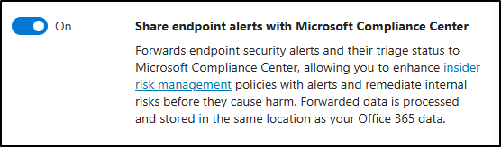

---
lab:
  title: Übung 1 - Implementieren von Insider-Risikomanagement
  module: Module 3 - Implement Insider Risk Management
---

## WWL-Mandanten – Nutzungsbedingungen

Wenn Ihnen im Rahmen einer Präsenzschulung ein Mandant zugewiesen worden ist, steht dieser für Praxislabs innerhalb der Präsenzschulung zur Verfügung.

Mandanten sollten nicht für Zwecke außerhalb von Praxislabs freigegeben oder verwendet werden. Der in diesem Kurs verwendete Mandant ist ein Testmandant; er kann nach Abschluss des Kurses nicht verwendet oder erreicht werden und ist nicht für Erweiterungen geeignet.

Mandanten dürfen nicht in ein kostenpflichtiges Abonnement konvertiert werden. Die im Rahmen dieses Kurses erworbenen Mandanten verbleiben im Eigentum der Microsoft Corporation, und wir behalten uns das Recht vor, jederzeit auf Mandanten zuzugreifen und diese zurückzuziehen.

# Labor 3 - Übung 1 - Implementieren von Insider-Risikomanagement

Sie sind Joni Sherman, der Informationssicherheitsadministrator von Contoso Ltd. Ihre Aufgabe besteht darin, die Compliance sicherzustellen und sensible Informationen innerhalb des Unternehmens zu schützen. Kürzlich hat Contoso Ltd. ungewöhnliche Browsing-Aktivitäten festgestellt, die möglicherweise sensible Daten anzeigen könnten. Um diesem Insider-Risiko proaktiv zu begegnen, implementieren Sie das Microsoft Purview Insider-Risikomanagement, das sich auf die Identifizierung, Analyse und effektive Antwort auf potenzielle Insider-Bedrohungen konzentriert.

**Aufgaben:**

1. Zuweisen von Berechtigungen für das Insider-Risikomanagement
1. Konfigurieren von Insider-Risikoindikatoren
1. Erstellen einer Richtlinie für Insiderrisiken
1. Anpassen der Richtlinie für Datenlecks
1. Aktivieren der Integration von Microsoft Defender for Endpoint mit Insider-Risikomanagement
1. Aktivieren von Indikatoren und Konfigurieren von vorrangigen Benutzenden
1. Erstellen einer Richtlinie für Verstöße gegen Sicherheitsrichtlinien durch vorrangige Benutzende
1. Erstellen einer Notizvorlage

## Aufgabe 1 - Zuweisen von Berechtigungen für das Insider-Risikomanagement

In dieser Aufgabe weisen Sie Joni Sherman die Rolle Insider-Risikomanagement zu, damit sie auf Insider-Risikofunktionen in Microsoft Purview zugreifen und diese verwalten kann.

1. Melden Sie sich bei der Client 1 VM (SC-401-CL1) im **SC-401-cl1\admin** -Konto an.

1. Navigieren Sie in Microsoft Edge zu **`https://purview.microsoft.com`** und melden Sie sich im Microsoft Purview-Portal als MOD-Administrator an, `admin@WWLxZZZZZZ.onmicrosoft.com` (wobei ZZZZZZ Ihre eindeutige Mandanten-ID ist, die von Ihrem Anbieter für das Hosting von Übungen bereitgestellt wird). Das Passwort der administrierenden Person sollte von Ihrem Lab-Hosting-Anbieter bereitgestellt werden.

1. Wählen Sie **Einstellungen** > **Rollen und Geltungsbereiche** > **Rollengruppen**.

1. Auf der Seite **Rollengruppen für Microsoft Purview-Lösungen** wählen Sie **Insider-Risikomanagement**.

1. Wählen Sie im Flyoutbereich **Insider-Risikomanagement** auf der rechten Seite **Bearbeiten**.

1. Auf der Seite **Mitglieder der Rollengruppe bearbeiten** wählen Sie **+ Benutzende auswählen**.

1. Suchen Sie im Flyoutbereich **Benutzende auswählen** nach `Joni` und aktivieren Sie das Kontrollkästchen für **Joni Sherman**.

1. Wählen Sie die Schaltfläche **Auswählen** am unteren Rand des Bereichs.

1. Auf der Seite **Mitglieder der Rollengruppe bearbeiten** wählen Sie **Weiter**.

1. Wählen Sie auf der Seite **Die Rollengruppe überprüfen und beenden** die Option **Speichern**.

1. Wenn Sie Joni erfolgreich zu der Rollengruppe hinzugefügt haben, wählen Sie **Erledigt** auf der Seite **Sie haben die Rollengruppe erfolgreich aktualisiert**.

1. Melden Sie sich vom **Mod Administrator** Konto ab, indem Sie das MA Symbol oben rechts im Fenster auswählen und dann **Abmelden** wählen.

Sie haben Joni die erforderlichen Berechtigungen für die Arbeit mit dem Insider-Risikomanagement im Microsoft Purview-Portal zugewiesen.

## Aufgabe 2 - Konfigurieren von Insider-Risikoindikatoren

Bevor Sie eine Richtlinie zum Insider-Risiko erstellen, schalten Sie die Indikatoren ein, die zum Erkennen erforderlich sind. Diese Indikatoren legen fest, nach welchen Typen von riskanten Aktivitäten das System sucht.

1. Navigieren Sie in **Microsoft Edge** zu **`https://purview.microsoft.com`** und melden Sie sich im Microsoft Purview-Portal als `JoniS@WWLxZZZZZZ.onmicrosoft.com` an (wobei ZZZZZZ Ihre eindeutige Mandanten-ID ist, die von Ihrem Anbieter für das Hosting von Übungen bereitgestellt wird).

1. Wählen Sie **Einstellungen** > **Insider-Risikomanagement**.

1. Wählen Sie die Registerkarte auf der linken Seite für **Richtlinienindikatoren**.

1. Erweitern Sie auf der Seite **Richtlinienindikatoren** und wählen Sie **Alle auswählen**, um alle Indikatoren in diesen Kategorien zu aktivieren:

   - Office-Indikatoren
   - Kumulative Erkennung von Exfiltration

1. Wählen Sie unten auf der Seite **Speichern** aus.

Sie haben wichtige Richtlinien-Indikatoren aktiviert, damit das System sensible Aktionen wie die Exfiltration von Dateien oder riskante Office-Aktivitäten erkennen kann.

## Aufgabe 3 - Erstellen einer Richtlinie über Insiderrisiken

In dieser Aufgabe erstellen Sie eine Richtlinie zur schnellen Erkennung von Datenlecks, um automatisch das Risikobenutzerverhalten im Zusammenhang mit der Datenexfiltration zu erkennen und darauf zu antworten. Schnelle Richtlinien verwenden integrierte Vorlagen und Standardschwellenwerte, um die Einrichtung zu vereinfachen.

1. Wählen Sie in Microsoft Purview **Lösungen** > **Insider-Risikomanagement** > **Richtlinien**.

1. Wählen Sie auf der Seite **Richtlinien** die Option **Richtlinie erstellen** und anschließend die Option **Schnellrichtlinie**.

1. Wählen Sie im Flyout **Schnellrichtlinien erstellen** unter **Datenlecks** die Option **Starten**.

1. Überprüfen Sie die Einstellungen zum Erstellen einer Richtlinie für schnelle Datenlecks und wählen Sie dann **Richtlinie erstellen**.

1. Aktivieren Sie auf der Seite **Ihre Richtlinie für Datenlecks wird erstellt** die Kontrollkästchen für:

   - E-Mail an mich, wenn Richtlinien ungelöste Warnungen haben
   - E-Mail an mich, wenn neue Warnungen mit hohem Schweregrad generiert werden

     Wählen Sie dann **Benachrichtigungseinstellungen aktualisieren**.

1. Wählen Sie unten auf der Seite **Ihre Richtlinie für Datenlecks wird erstellt** die Option **Erledigt**.

Sie haben eine schnelle Richtlinie zum Erkennen potenzieller Datenlecks mithilfe der Standardeinstellungen erstellt. Als Nächstes werden Sie es anpassen, um die Konfigurationswarnung zu lösen.

## Aufgabe 4 - Anpassen der Richtlinie über Datenlecks

Einige Richtlinien zu Insiderrisiken erfordern zusätzliche Indikatoren, um korrekt zu funktionieren. In dieser Aufgabe werden Sie Ihre Richtlinie ändern, um Sequenzindikatoren zu aktivieren und die Richtlinie in einen gesunden Zustand zu versetzen.

Auf der Seite **Richtlinien** für **Insider-Risikomanagement** werden Sie feststellen, dass Ihre Richtlinie über Datenlecks eine Empfehlung enthält.

1. Wählen Sie die soeben erstellte **Datenlecks-Schnellrichtlinie**.

1. Überprüfen Sie die Empfehlung auf der Flyout-Seite für die Richtlinie. Sie erhalten eine Warnung, die besagt, dass **Erforderliche Kennzeichen für den Trigger der Sequenz nicht markiert sind**. Um diese Warnung zu einer Lösung zu bringen, wählen Sie **Richtlinie bearbeiten**.

1. Wählen Sie auf der Seite **Vorlage auswählen** **Weiter**.

1. Wählen Sie auf der Seite **Benennen Sie Ihre Richtlinie** die Option **Weiter**.

1. Wählen Sie auf der Seite **Benutzende, Gruppen & adaptive Geltungsbereiche auswählen** die Option **Weiter**.

1. Wählen Sie auf der Seite **Benutzende und Gruppen ausschließen (optional) (Vorschau)** **Weiter**.

1. Wählen Sie auf der Seite **Entscheiden, ob Inhalte priorisiert werden sollen** die Option **Weiter**.

1. Überprüfen Sie auf der Seite **Auslösendes Ereignis für diese Richtlinie auswählen** die **Auswahl der Sequenzen, die diese Richtlinie auslösen** und sehen Sie sich die Informationen an, die besagen, dass **Bei einigen Sequenzen müssen bestimmte Indikatoren in den „Einstellungen“ aktiviert werden, bevor sie unten ausgewählt werden können.**

1. Wählen Sie die Option **Indikatoren einschalten**, um die erforderlichen Sequenzindikatoren für diese Richtlinie zu aktivieren.

1. Bei Datenlecks handelt es sich in erster Linie um eine Richtlinie für das Insiderrisiko der Datenexfiltration. Im Dialog zum Aktivieren der Sequenzindikatoren wählen Sie **Alle auswählen**, um alle erforderlichen **Exfiltrationsindikatoren** zu aktivieren, und wählen Sie dann **Speichern**.

1. Wählen Sie **Weiter** auf der Seite **Auslösendes Ereignis für diese Richtlinie auswählen**.

1. Wählen Sie auf der Seite **Schwellenwerte für das Auslösen von Ereignissen auswählen** die Option **Weiter**.

1. Wählen Sie auf der Seite **Indikatoren** **Weiter**.

1. Wählen Sie auf der Seite **Erkennungsoptionen** **Weiter**.

1. Wählen Sie auf der Seite **Wählen Sie den Typ des Schwellenwerts für Indikatoren** die Option **Weiter**.

   Diese Richtlinie verwendet ein integriertes auslösendes Ereignis und Indikatoren. Er startet die Auswertung der Benutzenden-Aktivitäten erst, wenn Microsoft Defender for Endpoint Bedrohungen wie Verteidigungsumgehungen oder unerwünschte Software erkennt.

1. Wählen Sie auf der Seite **Einstellungen überprüfen und fertigstellen** die Option **Absenden** aus.

1. Wählen Sie **Erledigt** auf der Seite **Ihre Richtlinie wurde erstellt**.

1. Zurück auf der Seite **Policies** sollte Ihre Richtlinie nun den Status **Healthy** haben.

Ihre Richtlinie für Insider-Risiken ist nun in Ordnung und bereit, riskante Aktivitäten auf der Grundlage von Sequenz-Triggern und aktivierten Indikatoren zu erkennen.

## Aufgabe 5 - Aktivieren der Integration von Microsoft Defender for Endpoint mit dem Insider-Risikomanagement

In dieser Aufgabe aktivieren Sie die Integration zwischen Microsoft Defender für Endpoint und Microsoft Purview, damit Sicherheitswarnungen in Richtlinien für Insiderrisiken verwendet werden können.

1. Navigieren Sie in Microsoft Edge zu Microsoft Defender, indem Sie zu `https://security.microsoft.com` gehen.

1. Wählen Sie im linken Navigationsbereich **Einstellungen** > **Endpunkte** > **Erweiterte Funktionen**.

1. Scrollen Sie nach unten und wählen Sie den Schalter **Ein** für die Option **Endpunktwarnungen mit dem Microsoft Compliance Center teilen**.

   

1. Wählen Sie **Einstellungen speichern** am unteren Rand des Bildschirms.

Sie haben Defender for Endpoint erfolgreich aktiviert, um Warnungen mit Microsoft Purview zu teilen.

## Aufgabe 6 - Aktivieren von Indikatoren und Konfigurieren von vorrangigen Benutzenden

In dieser Aufgabe konfigurieren Sie die Richtlinienindikatoren und erstellen eine prioritäre Benutzenden-Gruppe, die in Richtlinien zum Insider-Risiko verwendet werden kann.

> [!note] Die Microsoft Defender for Endpoint-Indikatoren sind möglicherweise ausgegraut und können nicht ausgewählt werden, wenn die Integration aus der vorherigen Aufgabe noch nicht abgeschlossen ist. Warten Sie in diesem Fall einige Minuten, und aktualisieren Sie die Seite, bevor Sie fortfahren.

1. Navigieren Sie in **Microsoft Edge** zu `https://purview.microsoft.com`.

1. Wählen Sie **Einstellungen** > **Insider-Risikomanagement**.

1. Wählen Sie die Registerkarte auf der linken Seite für **Richtlinienindikatoren**.

1. Erweitern Sie auf der Seite **Richtlinienindikatoren** und wählen Sie **Alle auswählen**, um alle Indikatoren in diesen Kategorien zu aktivieren:

   - Indikatoren in Microsoft Defender for Endpoint (Vorschau)
   - Riskante Browserindikatoren (Vorschau)

1. Wählen Sie unten auf der Seite **Speichern** aus.

1. Wählen Sie die Registerkarte **Prioritäre Benutzendengruppen** und dann **+ Prioritäre Benutzendengruppe erstellen**.

1. Auf der Seite **Benennung und Beschreibung der vorrangigen Benutzendengruppe** geben Sie ein:

   - **Name**: `Finance team`
   - **Beschreibung:** `Team members who manage financial operations, budgeting, and payroll systems.`

1. Wählen Sie **Weiter** aus.

1. Auf der Seite **Mitglieder** wählen Sie **+ Mitglieder**.

1. Im **Mitglieder** Flyout, suchen Sie nach und wählen Sie:

   - `Lynne Robbins`
   - `Debra Berger`
   - `Megan Bowen`

1. Wählen Sie **Hinzufügen**, um die drei Mitglieder der Prioritätsgruppe Finanzteam hinzuzufügen.

1. Wählen Sie **Weiter** aus.

1. Wählen Sie auf der Seite **Auswählen, wer die Daten der Benutzenden in dieser Prioritätsgruppe ansehen kann** die Option **+ Benutzenden- und Rollengruppen auswählen**.

1. Aktivieren Sie im Flyout das Kontrollkästchen für **Insider-Risikomanagement** und wählen Sie dann **Hinzufügen**.

1. Wählen Sie **Weiter** aus.

1. **Überprüfen** und **Senden** Sie Ihre Einstellungen und wählen Sie dann **Erledigt**, sobald Ihre vorrangige Benutzendengruppe erstellt wurde.

Sie haben Richtlinienindikatoren konfiguriert und eine Prioritätsgruppe zur Überwachung risikoreicher Benutzender erstellt.

## Aufgabe 7 - Erstellen einer Richtlinie für Verstöße gegen die Sicherheitsrichtlinien durch vorrangige Benutzende

In dieser Aufgabe erstellen Sie eine Richtlinie für Insider-Risiken, mit der Defender for Endpoint Warnungen für riskante Aktivitäten von Benutzenden mit Priorität erkennt.

1. Wählen Sie in Microsoft Purview **Lösungen** > **Insider-Risikomanagement** > **Richtlinien**.

1. Wählen Sie auf der Seite **Richtlinien** die Option **Richtlinie erstellen** und dann die Option **Benutzerdefinierte Richtlinie**.

1. Wählen Sie auf der Seite **Vorlage auswählen** die Option **Verletzungen der Sicherheitsrichtlinien durch vorrangige Benutzende (Vorschau)**, und wählen Sie dann „Weiter“.

1. Auf der Seite **Benennen Sie Ihre Richtlinie**, geben Sie ein:

   - **Name**: `Security policy violations - Priority users`
   - **Beschreibung:** `Detects Defender for Endpoint alerts for risky activity by priority users, such as malware or disabled protections.`

1. Wählen Sie **Weiter** aus.

1. Wählen Sie auf der Seite **Benutzende, Gruppen & adaptive Geltungsbereiche auswählen** die Option **Prioritäre Benutzendengruppen hinzufügen oder bearbeiten**.

1. Aktivieren Sie im Flyout **Wählen Sie vorrangige Benutzendengruppen** das Kontrollkästchen für die Gruppe **Finanzteam**, und wählen Sie Hinzufügen.

1. Wählen Sie **Weiter** aus.

1. Wählen Sie auf der Seite **Entscheiden Sie, ob Inhalte priorisiert werden sollen** die Option **Weiter**.

1. Wählen Sie auf der Seite **Auslösendes Ereignis für diese Richtlinie auswählen** die Option **Weiter**.

1. Wählen Sie auf der Seite **Indikatoren** **Weiter**.

1. Lassen Sie auf der Seite **Wählen Sie den Typ des Schwellenwerts für Indikatoren** die Standardoption **Von Microsoft bereitgestellte Schwellenwerte anwenden** ausgewählt, und wählen Sie dann **Weiter**.

1. Wählen Sie auf der Seite **Einstellungen überprüfen und fertigstellen** die Option **Absenden** aus.

1. Wählen Sie auf der Seite **Ihre Richtlinie wurde erstellt** die Option **Erledigt**.

Sie haben eine benutzerdefinierte Richtlinie für Insiderrisiken erstellt, die Defender for Endpoint-Signale verwendet, um riskante Aktivitäten von vorrangigen Benutzenden zu erkennen.

## Aufgabe 8 - Erstellen einer Notizvorlage

In dieser Aufgabe erstellen Sie eine Benachrichtigungsvorlage in Microsoft Purview, um Benutzende zu benachrichtigen, wenn eine Warnung zu Insiderrisiken ausgelöst wird.

1. Wählen Sie in Microsoft Purview **Lösungen** > **Insider-Risikomanagement** > **Benachrichtigungsvorlagen**.

1. Auf der Seite **Mitteilungsvorlagen** wählen Sie **+ Mitteilungsvorlage erstellen**.

1. Füllen Sie die erforderlichen Informationen im Flyoutbereich **Neue Kündigungsvorlage erstellen** auf der rechten Seite aus.

    - **Vorlagename**: `Security Violation Alert`
    - **Senden von**: `Joni Sherman`
    - **Betreff**: `Unusual activity detected - please review`
    - **Nachrichtentext**

        ````html
        <!DOCTYPE html>
        <html>
        <body>
        <h2>Security Alert</h2>
        <p>We've detected activity from your account that might violate our organization's security policies. This could be due to malware, disabled protections, or other risky behavior.</p>
        <p>Please review your recent actions and ensure your device security settings are up to date. If you believe this alert was generated in error, contact the IT Security team for assistance.</p>
        <p>To avoid future issues, refer to the <a href="https://contoso.com/security-guidelines">Contoso Security Guidelines</a>.</p>
        <p>Thank you,</p>
        <p><em>Compliance and Security Team</em></p>
        </body>
        </html>
        ````

1. Klicken Sie auf **Erstellen**.

1. Zurück auf der Seite **Benachrichtigungsvorlagen** sehen Sie die Vorlage **Warnung wegen Sicherheitsverstoß**, die Sie gerade erstellt haben.

Sie haben eine Benachrichtigungsvorlage erstellt, die das Insider-Risikomanagement verwenden kann, um Benutzende über Verstöße gegen Sicherheitsrichtlinien zu informieren.
