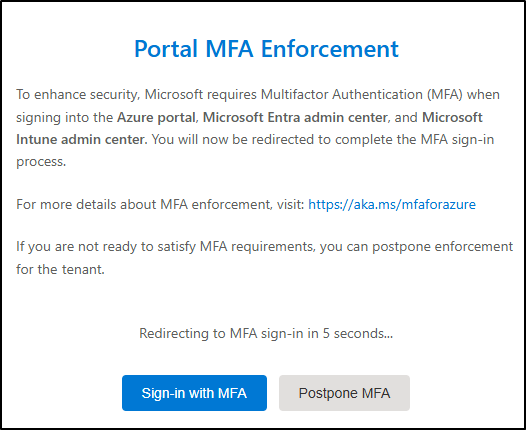
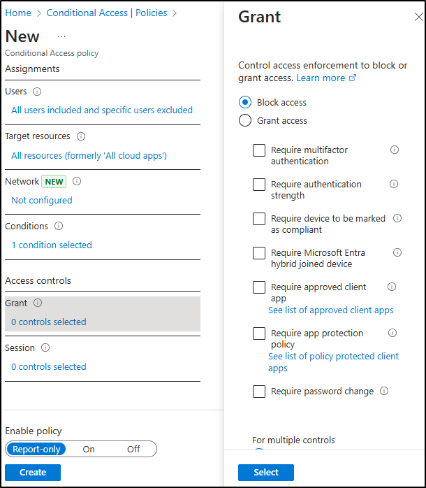

---
lab:
  title: Übung 2 - Implementieren eines adaptiven Schutzes
  module: Module 3 - Implement Insider Risk Management
---

# Labor 3 - Übung 2 - Implementieren eines adaptiven Schutzes

Sie sind Joni Sherman, der Informationssicherheitsadministrator von Contoso Ltd. Zu Ihren Aufgaben gehört es, sensible Daten zu schützen und auf Insider-Risiken zu antworten. Zur Verbesserung des Schutzes aktivieren Sie den adaptiven Schutz von Microsoft Purview, der die Erzwingung von Datenverlusten (DLP) auf der Grundlage der Risikostufen von Insidern dynamisch anpasst.

**Aufgaben:**

1. Zuweisen einer Richtlinie für Insiderrisiken zum adaptiven Schutz
1. Konfigurieren der Einstellungen für den adaptiven Schutz für Ihre DLP-Richtlinie
1. Konfigurieren des bedingten Zugriffs mit adaptivem Schutz
1. Aktivieren des adaptiven Schutzes

## Aufgabe 1 - Zuweisen einer Richtlinie für Insider-Risiken zum adaptiven Schutz

1. Melden Sie sich bei der Client 1 VM (SC-401-CL1) im **SC-401-cl1\admin** -Konto an.

1. Navigieren Sie in **Microsoft Edge** zu **`https://purview.microsoft.com`** und melden Sie sich als **Joni Sherman**`JoniS@WWLxZZZZZZ.onmicrosoft.com` an (wobei ZZZZZZ Ihre eindeutige Mandanten-ID ist, die von Ihrem Anbieter für das Hosting von Übungen bereitgestellt wird).

1. Navigieren Sie im Microsoft Purview-Portal zu **Lösungen** > **Insider-Risikomanagement** > **Adaptiver Schutz**.

1. Wählen Sie im linken Bereich der Navigation die Option **Risikostufen**.

1. Auf der Seite **Insider Risikostufen**:

   - Wählen Sie in der Dropdown-Liste Insiderrisiko-Richtlinie die **Schnellrichtlinie für Datenlecks**, die Sie in einer früheren Übung erstellt haben.
   - Lassen Sie die Standardeinstellungen für die Risikostufe unverändert.
   - Wählen Sie **Speichern**.

Sie haben eine Richtlinie zum Insiderrisiko mit dem adaptiven Schutz verknüpft und damit dynamische risikobasierte Aktionen in Microsoft Purview aktiviert.

## Aufgabe 2 - Konfigurieren Sie die Einstellungen für den adaptiven Schutz für Ihre DLP-Richtlinie

Da der adaptive Schutz nun mit Ihrer Richtlinie für Insider-Risiken verknüpft ist, können Sie eine DLP-Richtlinie aktualisieren, um auf erhöhte Risikostufen zu antworten, indem Sie die Freigabe sensibler Daten blockieren.

1. Navigieren Sie in Microsoft Purview zu **Lösungen** > **Vermeidung von Datenverlusten** > **Richtlinien**.

1. Aktivieren Sie auf der Seite **Richtlinien** das Kontrollkästchen für die in einer früheren Übung erstellte Richtlinie **DLP – Kreditkartenschutz**, und wählen Sie dann **Richtlinie bearbeiten**.

1. Wählen Sie in der DLP-Konfiguration **Weiter**, bis Sie die Seite **Erweiterte DLP-Regeln konfigurieren** erreichen.

1. Wählen Sie das Symbol mit dem Bleistift neben der Regel **Kreditkarteninformationen**, um sie zu bearbeiten.

1. Auf der Seite **Regel bearbeiten**:
   - Geben Sie in das Feld **Beschreibung** ein: `Block sharing of credit card data when user has an elevated insider risk level.`
   - Wählen Sie im Abschnitt **Bedingungen** die Option **Bedingung hinzufügen** > **Insider Risikostufe für adaptiven Schutz ist**.
   - Wählen Sie im neuen Abschnitt **Erhöhtes Risiko**.
   - Legen Sie unter **Aktionen** **Zugriff einschränken oder den Inhalt in Microsoft 365 verschlüsseln** auf **Jeden sperren** fest.
   - Wählen Sie **Speichern**, um die Regel zu aktualisieren.

1. Wählen Sie auf der Seite **Erweiterte DLP-Regeln anpassen** die Option **Weiter** aus.

1. Lassen Sie auf der Seite **Richtlinienmodus** die Richtlinie aktiv und wählen Sie dann **Weiter**.

1. Wählen Sie auf der Seite **Überprüfen und beenden** die Option **Senden** und dann **Erledigt**, sobald Ihre Richtlinie aktualisiert ist.

Sie haben Ihre DLP-Richtlinie aktualisiert, um die Freigabe zu blockieren, wenn ein erhöhtes Insider-Risiko besteht, und so den Datenschutz auf der Grundlage des Verhaltens des Benutzenden zu stärken.

## Aufgabe 3 – Konfigurieren des bedingten Zugriffs mit adaptivem Schutz

Um eine weitere Ebene der Erzwingung hinzuzufügen, können Sie Insider-Risikostufen verwenden, um den Zugriff mithilfe der Zugangskontrolle zu beschränken. In dieser Aufgabe werden Sie eine Richtlinie erstellen, die den Zugriff für Benutzende mit einer erhöhten Risikostufe sperrt.

1. Melden Sie sich in Microsoft Purview von Jonis Konto ab und schließen Sie alle Browserfenster.

1. Öffnen Sie ein neues Microsoft Edge-Fenster und navigieren Sie zum **Microsoft Entra Admin Center** unter `https://entra.microsoft.com`. Melden Sie sich als **MOD-Administrator**, `admin@WWLxZZZZZZ.onmicrosoft.com` an (wobei ZZZZZZ Ihre eindeutige Mandanten-ID ist, die Sie von Ihrem Anbieter für das Hosting von Übungen bereitgestellt haben). Das Admin-Passwort sollte von Ihrem Provider für die Übung bereitgestellt werden.

> [!note] **Hinweis**: In einigen Mandanten wird bei der Anmeldung möglicherweise ein Prompt zur Durchsetzung der Portal-MFA angezeigt. Wenn diese Aufforderung angezeigt wird:
> - Wählen Sie **MFA verschieben**, um die Einrichtung der MFA vorübergehend zu verzögern.
>
>   
> - Wählen Sie **Verschiebung bestätigen** aus.
>
> - Wählen Sie **Anmeldung ohne MFA fortsetzen** aus, um auf Microsoft Entra zuzugreifen.
>
> Dadurch wird die MFA-Erzwingung für den Mandanten verschoben, und Sie können mit dem Lab fortfahren.

1. Navigieren Sie im Microsoft Entra Admin Center zu **Schutz** > **Bedingter Zugriff** > **Richtlinien**.

1. Auf der Seite **Richtlinien** wählen Sie **+ Neue Richtlinie**.

1. Auf der Seite **Neue Richtlinie** benennen Sie Ihre Richtlinie: `Block all access for elevated risk`.

1. Konfigurieren Sie unter **Zuweisungen** den Abschnitt **Benutzende**:

   - **Einbeziehen**: Alle Benutzender  
   - **Ausschließen**: `Joni Sherman` und `MOD Administrator`

     

1. Stellen Sie unter **Zielressourcen** sicher, dass das Dropdown-Menü auf **Ressourcen (ehemals Cloud-Apps)** festgelegt ist, und wählen Sie **Alle Ressourcen (ehemals 'Alle Cloud-Apps')**.

     

1. Wählen Sie unter **Bedingungen** die Option **Insiderrisiko**. Legen Sie **Konfigurieren** auf **Ja** fest, dann konfigurieren Sie die Risikostufe auf **Erhöht**.

     

1. Klicken Sie unter **Zugriffskontrollen** auf **Gewähren**. Wählen Sie **Zugriff blockieren** und dann **Auswählen** am unteren Rand des Flyouts.

     

1. Bestätigen Sie unten auf der Seite, dass **Richtlinie aktivieren** auf **Nur Bericht** festgelegt ist, und wählen Sie dann **Erstellen**.

1. Zurück auf der Seite **Richtlinien** für den bedingten Zugriff, wählen Sie **Aktualisieren**, um zu überprüfen, ob Ihre neu erstellte Richtlinie angezeigt wird.

1. Melden Sie sich vom Mod-Administrator-Konto ab, indem Sie das Symbol MA oben rechts im Fenster auswählen, dann **Abmelden** wählen und alle Browserfenster schließen.

Sie haben eine Richtlinie für bedingten Zugriff erstellt, die den Zugriff für Benutzende mit erhöhtem Risiko sperrt, ohne den Zugriff sofort zu beeinträchtigen, da sich die Richtlinie im reinen Berichtsmodus befindet.

## Aufgabe 4 - Aktivieren des adaptiven Schutzes

In dieser letzten Aufgabe werden Sie den adaptiven Schutz aktivieren, damit das System die dynamische Erzwingung auf der Grundlage des Insiderrisikos anwenden kann.

1. Öffnen Sie **Microsoft Edge**, navigieren Sie zu **`https://purview.microsoft.com`** und melden Sie sich als **Joni Sherman**`JoniS@WWLxZZZZZZ.onmicrosoft.com` an (wobei ZZZZZZ Ihre eindeutige Mandanten-ID ist, die von Ihrem Anbieter für das Hosting von Übungen bereitgestellt wird).

1. Navigieren Sie zu **Lösungen** > **Insider-Risikomanagement** > **Adaptiver Schutz**.

1. Bestätigen Sie Ihre Konfigurationen:

   - Auf der Registerkarte **Insider-Risikostufen** wird die Richtlinie **Datenlecks schnell** ausgewählt.

   - Auf der Registerkarte **Bedingter Zugriff** wird die Richtlinie **Alle Zugriffe für erhöhtes Risiko blockieren** angezeigt.

   - Auf der Registerkarte **Verhinderung von Datenverlusten** ist die Richtlinie **DLP - Kreditkartenschutz** aufgeführt.

1. Wählen Sie die Registerkarte **Einstellungen für den adaptiven Schutz**.

1. Schalten Sie **Adaptiver Schutz** auf **Ein** und wählen Sie dann **Speichern**.

Sie haben den adaptiven Schutz erfolgreich aktiviert. Erzwingungsmaßnahmen werden jetzt automatisch an die Risikostufe eines Benutzenden angepasst.
