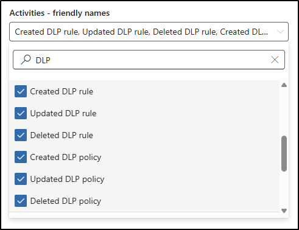

---
lab:
  title: Übung 1 - Durchsuchen des Überwachungsprotokolls
  module: Module 6 - Audit and search activity in Microsoft Purview
---

## WWL-Mandanten – Nutzungsbedingungen

Wenn Ihnen im Rahmen einer Präsenzschulung ein Mandant zugewiesen worden ist, steht dieser für Praxislabs innerhalb der Präsenzschulung zur Verfügung.

Mandanten sollten nicht für Zwecke außerhalb von Praxislabs freigegeben oder verwendet werden. Der in diesem Kurs verwendete Mandant ist ein Testmandant; er kann nach Abschluss des Kurses nicht verwendet oder erreicht werden und ist nicht für Erweiterungen geeignet.

Mandanten dürfen nicht in ein kostenpflichtiges Abonnement konvertiert werden. Die im Rahmen dieses Kurses erworbenen Mandanten verbleiben im Eigentum der Microsoft Corporation, und wir behalten uns das Recht vor, jederzeit auf Mandanten zuzugreifen und diese zurückzuziehen.

# Übung 6 - Übung 1 - Durchsuchen des Überwachungsprotokolls

Sie sind Joni Sherman, ein Informationssicherheitsadministrator bei Contoso Ltd. Im Rahmen der Stärkung der Untersuchungs- und Compliance-Bereitschaft Ihres Unternehmens wurden Sie gebeten, Microsoft Purview Audit zu verwenden, um Änderungen an der DLP-Konfiguration zu konfigurieren und sicherzustellen, dass Audit-Aufzeichnungen für sensible Aktivitäten über einen erweiterten Zeitraum aufbewahrt werden. Sie suchen nach Audit-Ereignissen im Zusammenhang mit DLP-Richtlinien, exportieren die Ergebnisse für die Offline-Analyse und konfigurieren eine Richtlinie für die Überwachungs-Aufbewahrung, die wichtige Aufzeichnungen über Exchange-, SharePoint- und Endpunkt-Aktivitäten aufbewahrt.

**Aufgaben:**

1. Suchen nach DLP-bezogenen Aktivitäten
1. Exportieren der Suchergebnisse des Überwachungsprotokolls
1. Erstellen einer Aufbewahrungsrichtlinie für Überwachungsprotokolle

## Aufgabe 1 - Suchen nach DLP-bezogenen Aktivitäten

In dieser Aufgabe verwenden Sie die Microsoft Purview Audit-Lösung, um nach aktuellen Ereignissen im Zusammenhang mit DLP-Richtlinien und -Regeln zu suchen.

1. Navigieren Sie in Microsoft Edge zu `https://purview.microsoft.com` und melden Sie sich beim Microsoft Purview-Portal als **Joni Sherman**`JoniS@WWLxZZZZZZ.onmicrosoft.com` an (wobei ZZZZZZ Ihre eindeutige Mandanten-ID ist, die Sie von Ihrem Anbieter für das Hosting von Übungen bereitgestellt haben). Das Passwort von Joni wurde in einer früheren Übung festgelegt.

1. Navigieren Sie in Microsoft Purview zu **Lösungen** > **Überwachung**.

1. Auf der Seite **Suche** konfigurieren Sie Ihre Suche:

   - **Datum und Zeitraum (UTC)**:

     - **Startdatum**: vor 3 Tagen
     - **Enddatum**: Heute

   - **Aktivitäten - Anzeigenamen**: Suchen Sie nach `DLP` und wählen Sie die folgenden Aktivitäten unter **Informationsschutz und DLP-Aktivitäten** aus:

     - Erstellte DLP-Regel
     - Aktualisierte DLP-Regel
     - Gelöschte DLP-Regel
     - Erstellte DLP-Richtlinie
     - Aktualisierte DLP-Richtlinie
     - Gelöschte DLP-Richtlinie

   

   - **Namen suchen**: `DLP Policy Activity`

1. Wählen Sie **Suchen** aus.

1. Es kann einige Minuten dauern, bis die Suche abgeschlossen ist. Während Audit Ihre Suche bearbeitet, aktualisieren Sie die Seite, um den **Auftragsstatus**, **Fortschritt (%)** und **Suchzeit** zu überprüfen.

1. Nach Abschluss wählen Sie **DLP Policy Activity**, um die Ergebnisse anzuzeigen.

1. Wählen Sie einzelne Ergebnisse aus, um detaillierte Informationen über jede DLP-Aktivität anzuzeigen.

Sie haben nach Audit-Aktivitäten im Zusammenhang mit der Konfiguration von DLP-Richtlinien und -Regeln gesucht und diese überprüft.

## Aufgabe 2 – Exportieren der Suchergebnisse

Mit dieser Aufgabe exportieren Sie die Suchergebnisse der DLP-Audits für die Offline-Analyse oder die Aufzeichnung der Konformität.

1. Navigieren Sie in Microsoft Purview zu **Lösungen** > **Überwachung**.

1. Wählen Sie auf der Seite **Suche** die **DLP-Richtlinien-Aktivität**, die Sie in der vorherigen Aufgabe erstellt haben.

1. Wählen Sie oben auf der Seite **Exportieren**aus.

1. Wählen Sie im Bestätigungsdialog **OK**, um den Export zu starten.

1. Wenn der Export abgeschlossen ist, wählen Sie den Link **Datei herunterladen** im grünen Banner **Ihr Export ist abgeschlossen**.

 > [!Note] **Hinweis**: Audit-Exportdateien werden im CSV-Format gespeichert und können in jedem Texteditor oder Tabellenkalkulationsprogramm geöffnet werden. Zur leichteren Überprüfung verwenden Sie Excel oder ein anderes Gerät zur Tabellenkalkulation. In dieser Übungsumgebung können Sie die CSV-Datei in Notepad öffnen, um zu überprüfen, ob der Export erfolgreich abgeschlossen wurde.

Sie haben DLP-bezogene Überwachungsprotokolle exportiert, die Sie mithilfe von Offline-Überprüfungen oder Aufzeichnungen verwenden können.

## Aufgabe 3 - Erstellung einer Richtlinie zur Aufbewahrung von Audits

In dieser Aufgabe konfigurieren Sie eine Richtlinie zur Aufbewahrung von Überwachungsprotokollen, um Protokolle zu DLP-Treffern und -Aktionen für langfristige Untersuchungen aufzubewahren.

1. Navigieren Sie in Microsoft Purview zu **Lösungen** > **Überwachung**.

1. Wählen Sie **Richtlinien** in der linken Seitenleiste.

1. Wählen Sie auf der Seite **Richtlinien** die Option **Neue Richtlinie zur Aufbewahrung von Audits**.

1. Geben Sie auf dem Bedienfeld **Neue Richtlinie zur Aufbewahrung von Audits** ein:

   - **Richtlinienname**: `Retain DLP Audit Logs`
   - **Beschreibung:** `Retains audit logs for DLP activities across Exchange, SharePoint, and endpoints to support investigation and compliance.`
   - **Benutzender**: Leer lassen, um sie auf alle Benutzenden anzuwenden
   - **Typ der Aufzeichnung**:
      - ComplianceDLPEndpoint
      - ComplianceDLPExchange
      - ComplianceDLPExchangeClassification
      - ComplianceDLPSharePoint
      - ComplianceDLPSharePointClassification
   - **Laufzeit**: 1 Jahr
   - **Priorität**: `1`

1. Wählen Sie **Speichern**, um die Richtlinie zur Aufbewahrung von Audits zu erstellen.

Sie haben eine Richtlinie zu konfiguriert, die Protokolle über DLP-Treffer und -Aktivitäten ein Jahr lang aufbewahrt.
