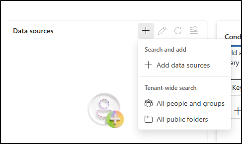

---
lab:
  title: Übung 2 - Durchführen einer Inhaltssuche
  module: Module 6 - Audit and search activity in Microsoft Purview
---

## WWL-Mandanten – Nutzungsbedingungen

Wenn Ihnen im Rahmen einer Präsenzschulung ein Mandant zugewiesen worden ist, steht dieser für Praxislabs innerhalb der Präsenzschulung zur Verfügung.

Mandanten sollten nicht für Zwecke außerhalb von Praxislabs freigegeben oder verwendet werden. Der in diesem Kurs verwendete Mandant ist ein Testmandant; er kann nach Abschluss des Kurses nicht verwendet oder erreicht werden und ist nicht für Erweiterungen geeignet.

Mandanten dürfen nicht in ein kostenpflichtiges Abonnement konvertiert werden. Die im Rahmen dieses Kurses erworbenen Mandanten verbleiben im Eigentum der Microsoft Corporation, und wir behalten uns das Recht vor, jederzeit auf Mandanten zuzugreifen und diese zurückzuziehen.

# Labor 6 - Übung 2 - Durchführen einer Inhaltssuche

Sie sind Joni Sherman, ein Informationssicherheitsadministrator bei Contoso Ltd. Das Unternehmen hat eine Warnung empfangen, dass sensible Finanzdaten angezeigt worden sein könnten. Sie wurden gebeten, Microsoft Purview zu verwenden, um in allen Microsoft 365 Diensten nach Inhalten zu suchen, die wichtige Begriffe aus dem Finanzbereich enthalten. Ihr Ziel ist es, zu ermitteln, ob sensible Inhalte in unangemessener Weise weitergegeben wurden, und die Ermittlungen zu unterstützen.

**Aufgaben:**

1. Zuweisen von eDiscovery-Berechtigungen
1. Suche nach Inhalten mithilfe von sensiblen Finanzbegriffen

## Aufgabe 1 - Zuweisen von eDiscovery-Berechtigungen

In dieser Aufgabe werden Sie Joni Sherman eDiscovery-Berechtigungen zuweisen, damit sie eine Inhaltssuche in Microsoft Purview durchführen kann.

1. Melden Sie sich bei Client 1 VM (SC-401-CL1) im **SC-401-CL1\admin** Konto an.

1. Wenn Sie als Joni angemeldet sind, melden Sie sich ab und schließen Sie alle Browserfenster.

1. Navigieren Sie in **Microsoft Edge** zu **`https://purview.microsoft.com`** und melden Sie sich im Microsoft Purview-Portal als **MOD-Administrator**`admin@WWLxZZZZZZ.onmicrosoft.com` an (wobei ZZZZZZ Ihre eindeutige Mandanten-ID ist, die von Ihrem Anbieter des Übungs-Hostings bereitgestellt wird). Das Passwort der administrierenden Person sollte von Ihrem Lab-Hosting-Anbieter bereitgestellt werden.

1. Wählen Sie in der linken Seitenleiste **Einstellungen** > **Rollen und Geltungsbereiche** > **Rollengruppen**.

1. Suchen Sie auf der Seite **Rollengruppen für Microsoft Purview-Lösungen** nach `eDiscovery`, und wählen Sie dann **eDiscovery Manager**.

1. Wählen Sie im Flyoutbereich **eDiscovery Manager** die Option **Bearbeiten**.

1. Wählen Sie auf der Seite **eDiscovery-Manager verwalten** die Option **Benutzer auswählen**.

1. Suchen Sie auf der Flyout-Seite **Benutzende auswählen** nach `Joni` und aktivieren Sie dann das Kontrollkästchen für **Joni Sherman**. Wählen Sie die Schaltfläche **Auswählen** am unteren Rand des Bereichs.

1. Zurück auf der Seite **eDiscovery-Manager verwalten** wählen Sie **Weiter** aus.

1. Wählen Sie auf der Seite **eDiscovery-Administrator verwalten** die Option **Benutzer auswählen** aus.

1. Wählen Sie auf der Seite **Die Rollengruppe überprüfen und beenden** die Option **Speichern**.

1. Wählen Sie auf der Seite **Sie haben die Rollengruppe erfolgreich aktualisiert** die Option **Fertig**.

1. Melden Sie sich vom MOD-Administrator-Konto ab, indem Sie das Symbol **MA** oben rechts im Fenster auswählen und dann **Abmelden** wählen.

Sie haben Joni Sherman eDiscovery-Berechtigungen zugewiesen, die es ihr ermöglichen, im Rahmen der Untersuchung nach sensiblen Inhalten zu suchen.

## Aufgabe 2 - Suche nach Inhalten mithilfe von sensiblen finanziellen Begriffen

1. Navigieren Sie in Microsoft Edge zu `https://purview.microsoft.com` und melden Sie sich beim Microsoft Purview-Portal als **Joni Sherman**`JoniS@WWLxZZZZZZ.onmicrosoft.com` an (wobei ZZZZZZ Ihre eindeutige Mandanten-ID ist, die Sie von Ihrem Anbieter für das Hosting von Übungen bereitgestellt haben). Das Passwort von Joni wurde in einer früheren Übung festgelegt.

1. Navigieren Sie in Microsoft Purview zu **Lösungen** > **eDiscovery**.

1. Wählen Sie auf der Seite **Fälle** das Dropdown-Menü neben **Fall erstellen** und dann **Suche erstellen**.

   

1. Geben Sie im Dialog **Details zum Starten eingeben** ein:

   - **Fallname**: `Financial Data Exposure Review`
   - **Namen suchen**: `Financial Data Leak Investigation`
   - **Fallbeschreibung**: `Case opened to support security investigation efforts by identifying potential exposure of sensitive financial terms in Microsoft 365 content.`
   - **Suchbeschreibung**: `Search targets common high-risk financial keywords to support data security monitoring and policy validation.`

1. Wählen Sie **Erstellen**, um die Suche zu erstellen.

1. Wählen Sie auf der Seite **Untersuchung von Finanzdatenlecks** unter **Datenquellen** **+** (Pluszeichen) > **Datenquellen hinzufügen**.

   

1. Wählen Sie im Flyout **Quellensuche** die Gruppe **Finanzteam** und wählen Sie dann **Speichern und schließen**.

1. Fügen Sie im Bereich **Bedingungsgenerator** die Schlüsselwörter `bank account` und `credit card` hinzu, und wählen Sie dann **Abfrage ausführen**.

   

1. Aktivieren Sie im Flyout **Suchergebnisse auswählen** unter **Statistiken** die Kontrollkästchen für **Kategorien einbeziehen** und **Bericht über Abfrage-Schlüsselwörter einbeziehen** und wählen Sie dann **Abfrage ausführen**.

1. Überprüfen Sie die Ergebnisse der Suche durch:

   - Wählen Sie die Registerkarte **Statistik**, um eine Zusammenfassung der Suchmetriken anzuzeigen.
   - Wählen Sie die Registerkarte **Muster**, um eine Vorschau des übereinstimmenden Inhalts anzuzeigen.

Sie haben eine stichwortbasierte Inhaltssuche durchgeführt, um herauszufinden, ob sensible Finanzdaten in unzulässiger Weise weitergegeben wurden. Diese Ergebnisse unterstützen bei Sicherheitsuntersuchungen und leiten zur Risikobewältigung an.
