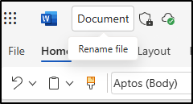

---
lab:
  title: 'Validierung von Richtlinien zu Empfindlichkeit, DLP und Aufbewahrung'
  module: 'Policy validation - Validate sensitivity, DLP, and retention policies'
---

## WWL-Mandanten – Nutzungsbedingungen

Wenn Ihnen im Rahmen einer Präsenzschulung ein Mandant zugewiesen worden ist, steht dieser für Praxislabs innerhalb der Präsenzschulung zur Verfügung.

Mandanten sollten nicht für Zwecke außerhalb von Praxislabs freigegeben oder verwendet werden. Der in diesem Kurs verwendete Mandant ist ein Testmandant; er kann nach Abschluss des Kurses nicht verwendet oder erreicht werden und ist nicht für Erweiterungen geeignet.

Mandanten dürfen nicht in ein kostenpflichtiges Abonnement konvertiert werden. Die im Rahmen dieses Kurses erworbenen Mandanten verbleiben im Eigentum der Microsoft Corporation, und wir behalten uns das Recht vor, jederzeit auf Mandanten zuzugreifen und diese zurückzuziehen.

# Übung zur Validierung - Validierung von Richtlinien für Empfindlichkeit, DLP und Aufbewahrung

Sie sind Joni Sherman, der Informationssicherheitsadministrator bei Contoso Ltd. Nachdem Sie nun Vertraulichkeitsbezeichnungen, Richtlinien zur Verhinderung von Datenverlusten (DLP) und zur Aufbewahrung konfiguriert haben, wurden Sie gebeten, zu überprüfen, ob diese Konfigurationen wie erwartet funktionieren. In dieser Übung testen Sie das Verhalten der einzelnen Richtlinien in Microsoft 365-Apps und überprüfen, ob die Inhalte gemäß Ihren Richtlinieneinstellungen geschützt und aufbewahrt werden.

**Aufgaben:**

1. Anwenden einer Vertraulichkeitsbezeichnung in Word
1. Auslösen einer DLP-Richtlinie in Outlook
1. Anwenden von Aufbewahrungs- und Vertraulichkeitsbezeichnungen in SharePoint

## Aufgabe 1 - Anwenden einer Vertraulichkeitsbezeichnung in Word

In dieser Aufgabe überprüfen Sie, ob die veröffentlichten Vertraulichkeitsbezeichnungen den Benutzenden zur Verfügung stehen und direkt aus Microsoft Word angewendet werden können.

1. Sie sollten weiterhin bei Client 1 VM (SC-401-CL1) im **SC-401-CL1\admin**-Konto angemeldet sein, und Sie sollten bei Microsoft 365 als **Joni Sherman**`JoniS@WWLxZZZZZZ.onmicrosoft.com` angemeldet sein (wobei ZZZZZZ Ihre eindeutige Mandanten-ID ist, die von Ihrem Anbieter für das Hosting der Übung bereitgestellt wird). Das Passwort von Joni wurde in einer früheren Übung festgelegt.

1. Navigieren Sie in Microsoft Edge zu `https://word.office.com` und melden Sie sich beim Microsoft Office als **Joni Sherman**`JoniS@WWLxZZZZZZ.onmicrosoft.com` an (wobei ZZZZZZ Ihre eindeutige Mandanten-ID ist, die Sie von Ihrem Anbieter für das Hosting von Labs erhalten haben). Das Passwort von Joni wurde in einer früheren Übung festgelegt.

1. Wählen Sie **Leeres Dokument**.

1. Wenn Sie dazu aufgefordert werden, schließen Sie das Dialogfeld **Ihre Datenschutzoptionen**.

1. Geben Sie den folgenden Text in das Dokument ein:

   `Important HR employee document.`

1. Wählen Sie **Vertraulichkeitsbezeichnung** im Menüband und wählen Sie **Intern** > **Mitarbeiterdaten (HR)**, um die neu erstellte Vertraulichkeitsbezeichnung auf dieses Dokument anzuwenden.

    

    > [!Note] Es kann 24-48 Stunden dauern, bis neu veröffentlichte Vertraulichkeitsbezeichnungen für die Anwendung zur Verfügung stehen. Wenn die neu erstellten Vertraulichkeitsbezeichnungen nicht verfügbar sind, können Sie **Vertraulich** > **Alle mitarbeitenden Personen** für diese Übung verwenden.

1. Ändern Sie die Vertraulichkeitsbezeichnung in **Streng vertraulich** > **Projekt - Falcon**, um zu überprüfen, ob das Dialogfeld zur Angabe einer geschäftlichen Begründung angezeigt wird.

1. Wählen Sie **Abbrechen**, um die Vertraulichkeitsbezeichnung beizubehalten.

1. Wählen Sie oben links im Dokument **Dokument**, um diese Datei umzubenennen, und benennen Sie sie in **`HR Document`** um. Drücken Sie die Eingabetaste, um diese Namensänderung anzuwenden.

    

Sie haben überprüft, dass die Vertraulichkeitsbezeichnung HR verfügbar ist und die entsprechenden Schutzmaßnahmen auf ein Word-Dokument angewendet werden.

## Aufgabe 2 - Auslösen einer DLP-Richtlinie in Outlook

Als Nächstes senden Sie sensible Informationen über mitarbeitende Personen in einer E-Mail, um zu überprüfen, ob Ihre DLP-Richtlinie die Aktivität korrekt erkennt und blockiert.

1. Sie sollten weiterhin bei Client 1 VM (SC-401-CL1) im **SC-401-CL1\admin**-Konto angemeldet sein und bei Microsoft 365 als Joni Sherman angemeldet sein.

1. Wählen Sie in Microsoft Edge die App-Startleiste oben links und wählen Sie **Outlook**.

1. Wählen Sie die Schaltfläche **Neue E-Mail** oben links, um eine neue Meldung zu verfassen.

1. In das Feld **An** geben Sie `Megan` ein und wählen Sie die E-Mail-Adresse von **Megan Bowen**.

1. Geben Sie in das Feld für den Betreff `Help with employee information` ein.

1. Geben Sie in den Text der E-Mail ein:

   ``` text
   Please help me with the start dates for the following employees:
   ABC123456
   DEF678901
   GHI234567

   Thank you, 
   Joni Sherman
   ```

1. Wählen Sie die Schaltfläche **Senden** oben rechts im Fenster der Nachricht, um die E-Mail zu versenden.

1. Sie sollten eine Nachricht empfangen, dass die E-Mail unzustellbar war und durch eine DLP-Richtlinie blockiert wurde.

   

Sie haben bestätigt, dass Ihre DLP-Richtlinie die Übertragung sensibler IDs mitarbeitender Personen per E-Mail blockiert hat.

## Aufgabe 3 - Anwenden von Kennzeichnungen zur Aufbewahrung und Vertraulichkeitsbezeichnung in SharePoint

Um Ihre Konfiguration für die Aufbewahrung zu testen, wenden Sie eine Kennzeichnung für die Aufbewahrung auf ein in SharePoint gelagertes Dokument an und überprüfen, ob auch Vertraulichkeitsbezeichnungen zur Verfügung stehen.

1. Sie sollten weiterhin bei Client 1 VM (SC-401-CL1) im **SC-401-CL1\admin**-Konto angemeldet sein und bei Microsoft 365 als Joni Sherman angemeldet sein.

1. Wählen Sie in Microsoft Edge das App-Startfeld oben links und wählen Sie **SharePoint**.

1. Suchen Sie auf der SharePoint Zielseite nach `Benefits` und wählen Sie dann **Vorteile @ Contoso** aus den Suchergebnissen.

1. Wählen Sie **Dokumente** im linken Bereich.

1. Wählen Sie auf der Seite **Dokumente** die Auslassungspunkte neben **Profit-sharing Plan.docx**, und wählen Sie dann **Details**.

   

1. Aktualisieren Sie im Bereich **Details** die folgenden Felder:
   - **Empfindlichkeit**: Vertraulich - Finanzen
   - **Kennzeichnung anwenden**: Sensible Finanzdaten

     

Sie haben bestätigt, dass Kennzeichnungen zur Aufbewahrung und Vertraulichkeitsbezeichnung verfügbar sind und auf SharePoint-Dokumente angewendet werden können.
